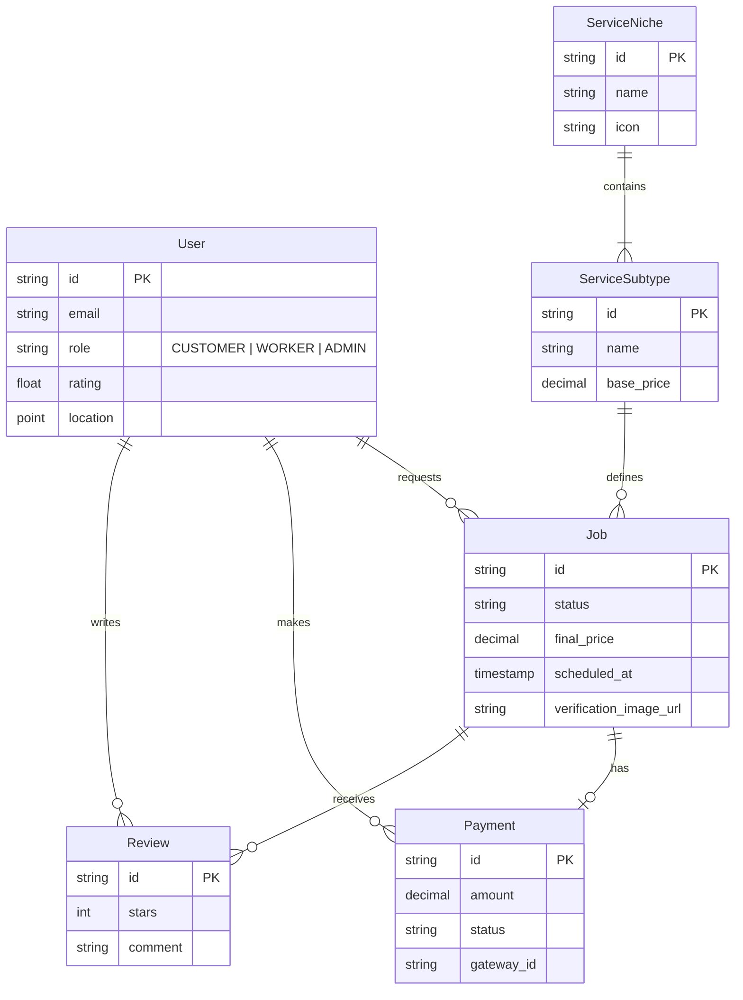
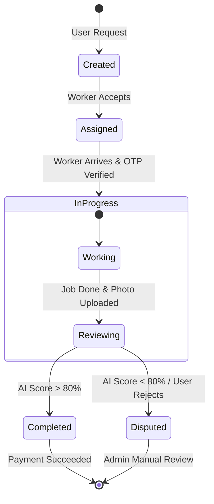
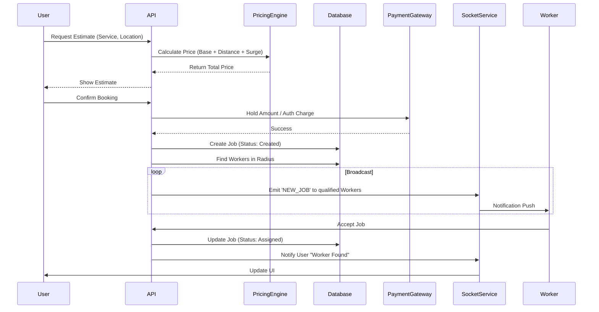

# System Architecture

This document details the technical architecture of InstaServe, including high-level design, database schema, state management, and interaction flows.

## 1. High-Level Architecture (HLD)

The system is built on a Next.js full-stack framework, utilizing Edge functions for low-latency responses and a centralized Node.js/PostgreSQL backend for data persistence and complex logic.

```mermaid
graph TD
    subgraph Client_Layer
        UserApp[User Mobile/Web App]
        WorkerApp[Worker Mobile/Web App]
    end

    subgraph Edge_Layer
        NextEdge[Next.js Edge Network]
        Auth[Auth Service (NextAuth)]
    end

    subgraph Core_Services
        API[Monolithic API Routes]
        Matchmaker[Matchmaking Engine]
        Pricing[Pricing Engine]
        Payment[Payment Service]
        Socket[Socket.io Server]
        AICheck[AI Verification Service]
    end

    subgraph Data_Layer
        Postgres[(PostgreSQL DB)]
        Redis[(Redis Cache)]
        S3[(AWS S3 Storage)]
    end

    subgraph External_Services
        MapsAPI[Google Maps API]
        OpenAI[OpenAI Vision API]
        Stripe[Stripe/Razorpay]
    end

    UserApp --> NextEdge
    WorkerApp --> NextEdge
    NextEdge --> Auth
    NextEdge --> API

    API --> Matchmaker
    API --> Pricing
    API --> Payment
    API --> AICheck

    Matchmaker --> MapsAPI
    Matchmaker --> Redis
    Pricing --> MapsAPI

    AICheck --> OpenAI
    Payment --> Stripe

    API --> Postgres
    API --> Redis
    API --> Socket

    Socket -.-> UserApp
    Socket -.-> WorkerApp
```

## 2. Database Schema (ERD)

We use a relational model to maintain strict data integrity, particularly for financial transactions and job states.



## 3. Job State Machine (LLD)

The lifecycle of a service request (Job) is strictly managed to prevent invalid transitions (e.g., paying for a cancelled job).



## 4. Sequence Diagram (Booking Flow)

The flow from a user requesting an estimate to a worker accepting the job.


