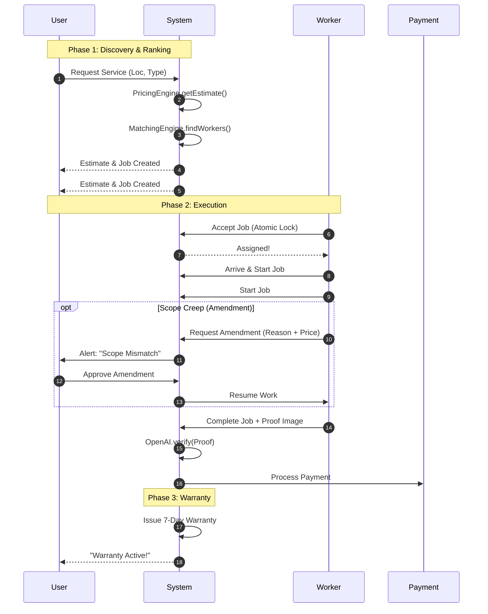
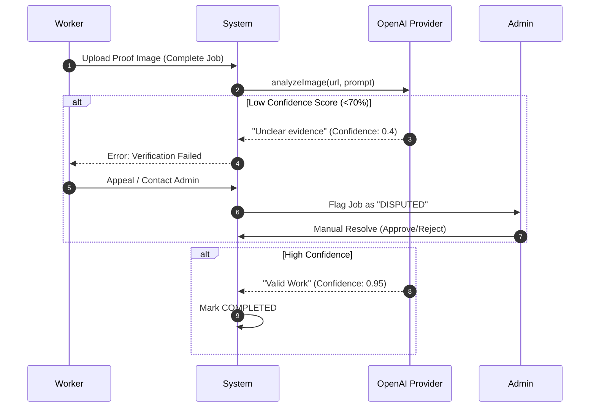
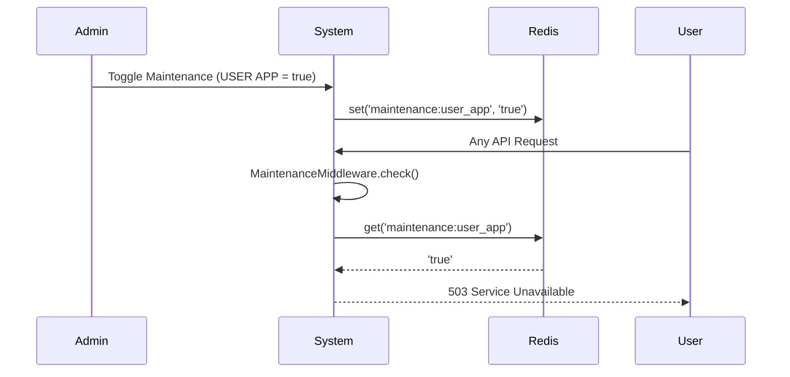

# Combined System Flows

This document unifies the specific architectural views into a single cohesive narrative, illustrating the complete lifecycle of the InstaServe platform, including advanced modules.

## 1. The Core Ecosystem
The following High-Level diagram re-iterates how all major components—Mobile Apps, Core Backend, and External APIs—orchestrate together.

```mermaid
graph TD
    subgraph Clients
        UserApp[User Application]
        WorkerApp[Worker Application]
        AdminPanel[Admin Dashboard]
    end

    subgraph "Core Backend Services"
        API[Monolith API]
        Factory[Service Factory]
        Match[Matchmaking Engine]
        Pricing[Pricing Engine]
        Ranking[Ranking Engine]
        JobMgr[Job Manager]
    end

    subgraph "External Providers"
        Stripe[Stripe (Payments)]
        Redis[Redis (OTP/Geo)]
        SMTP[Nodemailer (Email)]
        Cloudinary[Cloudinary (Storage)]
        OpenAI[OpenAI (Vision AI)]
    end

    UserApp --> API
    WorkerApp --> API
    AdminPanel --> API
    
    API --> Pricing
    API --> JobMgr
    JobMgr --> Match
    Match --> Ranking
    
    API --> Factory
    Factory --> Stripe
    Factory --> SMTP
    Factory --> Cloudinary
    Factory --> OpenAI
    Factory --> Redis
```

## 2. The Complete End-to-End Booking Cycle (with Scope Creep)
This sequence diagram shows the full path, including the potential for "Scope Creep" amendments.



## 3. Dispute Resolution Flow
Complex flow involving AI flagging and manual admin intervention.



## 4. Maintenance Mode Flow
Admin control over application availability.


