# Combined System Flows

This document illustrates the complete lifecycle of the Oddigo v2 platform, including all role-based flows, booking lifecycle, payment, warranty, and admin operations.

---

## 1. Core Ecosystem

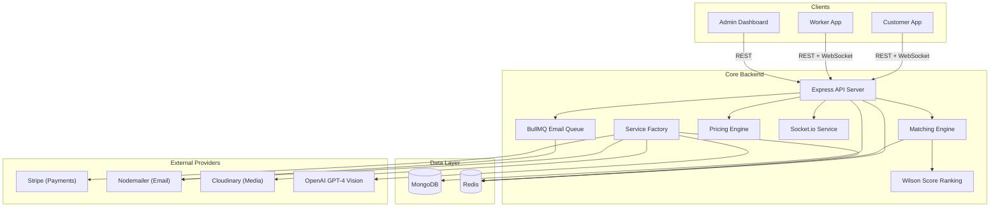
```mermaid
graph TD
    subgraph Clients
        UserApp[Customer App]
        WorkerApp[Worker App]
        AdminPanel[Admin Dashboard]
    end

    subgraph "Core Backend"
        API[Express API Server]
        Factory[Service Factory]
        Match[Matching Engine]
        Pricing[Pricing Engine]
        Ranking[Wilson Score Ranking]
        Socket[Socket.io Service]
        Queue[BullMQ Email Queue]
    end

    subgraph "Data Layer"
        MongoDB[(MongoDB)]
        Redis[(Redis)]
    end

    subgraph "External Providers"
        Stripe["Stripe (Payments)"]
        SMTP["Nodemailer (Email)"]
        Cloudinary["Cloudinary (Media)"]
        OpenAI["OpenAI GPT-4 Vision"]
    end

    UserApp -->|REST + WebSocket| API
    WorkerApp -->|REST + WebSocket| API
    AdminPanel -->|REST| API

    API --> MongoDB
    API --> Redis

    API --> Pricing
    API --> Match
    API --> Socket
    API --> Queue

    Match --> Ranking
    Match --> Redis

    Factory --> Stripe
    Factory --> SMTP
    Factory --> Cloudinary
    Factory --> OpenAI
    Factory --> Redis

    Queue --> SMTP
```

---

## 2. Complete 14-Step Booking Lifecycle

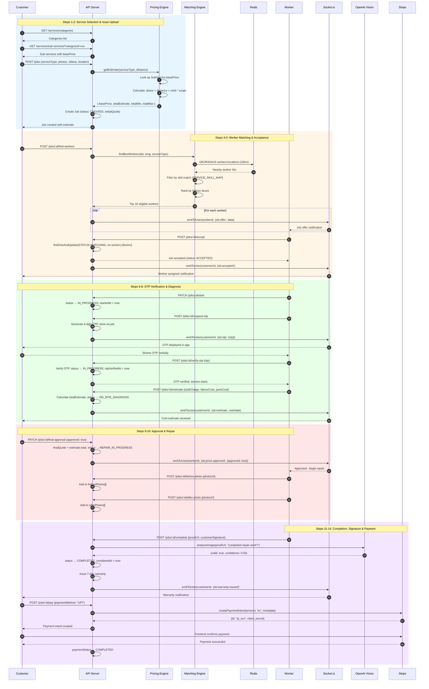
```mermaid
sequenceDiagram
    autonumber
    participant C as Customer
    participant API as API Server
    participant P as Pricing Engine
    participant M as Matching Engine
    participant R as Redis
    participant W as Worker
    participant S as Socket.io
    participant AI as OpenAI Vision
    participant Pay as Stripe

    rect rgb(230, 245, 255)
    Note over C, P: Steps 1-2: Service Selection & Issue Upload
    C->>API: GET /services/categories
    API-->>C: Categories list
    C->>API: GET /services/sub-services?categoryId=xxx
    API-->>C: Sub-services with basePrice
    C->>API: POST /jobs (serviceType, photos, videos, location)
    API->>P: getEstimate(serviceType, distance)
    P->>P: Look up SubService.basePrice
    P->>P: Calculate: (base + distance + visit) * surge
    P-->>API: { basePrice, totalEstimate, totalMin, totalMax }
    API->>API: Create Job (status: CREATED, initialQuote)
    API-->>C: Job created with estimate
    end

    rect rgb(255, 245, 230)
    Note over M, W: Steps 3-5: Worker Matching & Acceptance
    C->>API: POST /jobs/:id/find-workers
    API->>M: findBestWorkers(lat, long, serviceType)
    M->>R: GEORADIUS workers:locations (10km)
    R-->>M: Nearby worker IDs
    M->>M: Filter by skill match (SERVICE_SKILL_MAP)
    M->>M: Rank by Wilson Score
    M-->>API: Top 10 eligible workers
    loop For each worker
        API->>S: emitToUser(workerId, 'job:offer', data)
        S-->>W: Job offer notification
    end
    W->>API: POST /jobs/:id/accept
    API->>API: findOneAndUpdate(STATUS=MATCHING, no worker) [Atomic]
    API-->>W: Job accepted (status: ACCEPTED)
    API->>S: emitToUser(customerId, 'job:accepted')
    S-->>C: Worker assigned notification
    end

    rect rgb(230, 255, 230)
    Note over W, C: Steps 6-8: OTP Verification & Diagnosis
    W->>API: PATCH /jobs/:id/start
    API->>API: status → IN_PROGRESS, startedAt = now
    W->>API: POST /jobs/:id/request-otp
    API->>API: Generate 6-digit OTP, store on job
    API->>S: emitToUser(customerId, 'job:otp', {otp})
    S-->>C: OTP displayed in app
    C-->>W: Shares OTP verbally
    W->>API: POST /jobs/:id/verify-otp {otp}
    API->>API: Verify OTP, status → IN_PROGRESS, otpVerifiedAt = now
    API-->>W: OTP verified, service starts
    W->>API: POST /jobs/:id/estimate {visitCharge, labourCost, partsCost}
    API->>API: Calculate totalEstimate, status → ON_SITE_DIAGNOSIS
    API->>S: emitToUser(customerId, 'job:estimate', estimate)
    S-->>C: Cost estimate received
    end

    rect rgb(255, 230, 230)
    Note over C, W: Steps 9-10: Approval & Repair
    C->>API: PATCH /jobs/:id/final-approval {approved: true}
    API->>API: finalQuote = estimate.total, status → REPAIR_IN_PROGRESS
    API->>S: emitToUser(workerId, 'job:price-approved', {approved: true})
    S-->>W: Approved - begin repair
    W->>API: POST /jobs/:id/before-photo {photoUrl}
    API->>API: Add to beforePhotos[]
    W->>API: POST /jobs/:id/after-photo {photoUrl}
    API->>API: Add to afterPhotos[]
    end

    rect rgb(245, 230, 255)
    Note over W, Pay: Steps 11-14: Completion, Signature & Payment
    W->>API: POST /jobs/:id/complete {proofUrl, customerSignature}
    API->>AI: analyzeImage(proofUrl, "completed repair work?")
    AI-->>API: {valid: true, confidence: 0.92}
    API->>API: status → COMPLETED, completedAt = now
    API->>API: Issue 7-day warranty
    API->>S: emitToUser(customerId, 'job:warranty-issued')
    S-->>C: Warranty notification
    C->>API: POST /jobs/:id/pay {paymentMethod: "UPI"}
    API->>Pay: createPaymentIntent(amount, 'inr', metadata)
    Pay-->>API: {id: "pi_xxx", client_secret}
    API-->>C: Payment intent created
    C->>Pay: Frontend confirms payment
    Pay-->>C: Payment successful
    API->>API: paymentStatus → COMPLETED
    end
```

---

## 3. OTP Login Flow

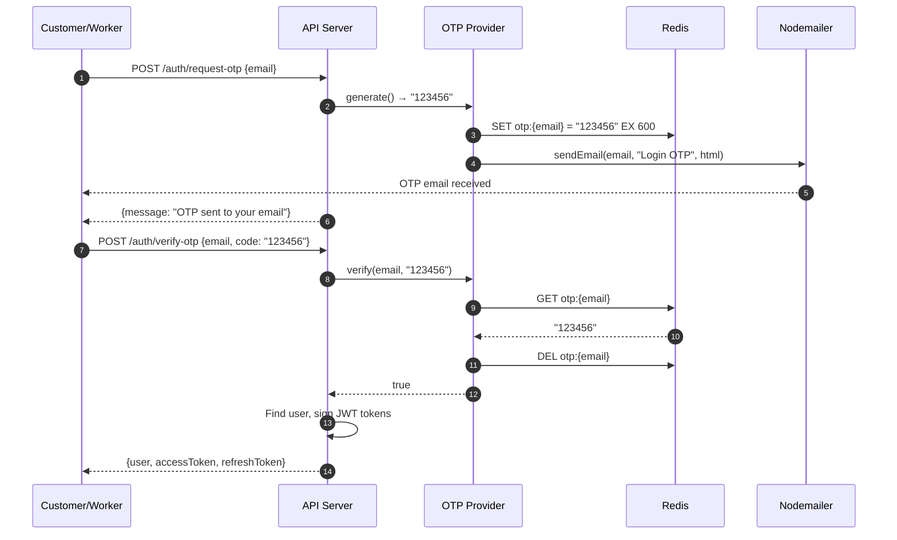
```mermaid
sequenceDiagram
    autonumber
    participant C as Customer/Worker
    participant API as API Server
    participant OTP as OTP Provider
    participant Redis
    participant Email as Nodemailer

    C->>API: POST /auth/request-otp {email}
    API->>OTP: generate() → "123456"
    OTP->>Redis: SET otp:{email} = "123456" EX 600
    OTP->>Email: sendEmail(email, "Login OTP", html)
    Email-->>C: OTP email received
    API-->>C: {message: "OTP sent to your email"}

    C->>API: POST /auth/verify-otp {email, code: "123456"}
    API->>OTP: verify(email, "123456")
    OTP->>Redis: GET otp:{email}
    Redis-->>OTP: "123456"
    OTP->>Redis: DEL otp:{email}
    OTP-->>API: true
    API->>API: Find user, sign JWT tokens
    API-->>C: {user, accessToken, refreshToken}
```

---

## 4. Scope Creep (Amendment) Flow

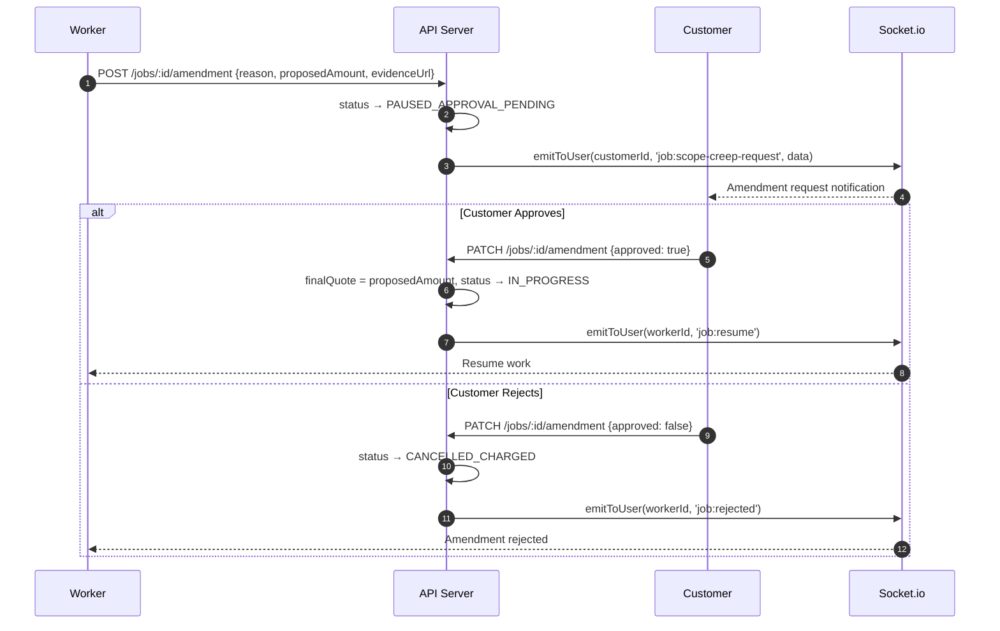
```mermaid
sequenceDiagram
    autonumber
    participant W as Worker
    participant API as API Server
    participant C as Customer
    participant S as Socket.io

    W->>API: POST /jobs/:id/amendment {reason, proposedAmount, evidenceUrl}
    API->>API: status → PAUSED_APPROVAL_PENDING
    API->>S: emitToUser(customerId, 'job:scope-creep-request', data)
    S-->>C: Amendment request notification

    alt Customer Approves
        C->>API: PATCH /jobs/:id/amendment {approved: true}
        API->>API: finalQuote = proposedAmount, status → IN_PROGRESS
        API->>S: emitToUser(workerId, 'job:resume')
        S-->>W: Resume work
    else Customer Rejects
        C->>API: PATCH /jobs/:id/amendment {approved: false}
        API->>API: status → CANCELLED_CHARGED
        API->>S: emitToUser(workerId, 'job:rejected')
        S-->>W: Amendment rejected
    end
```

---

## 5. Worker KYC & Verification Flow

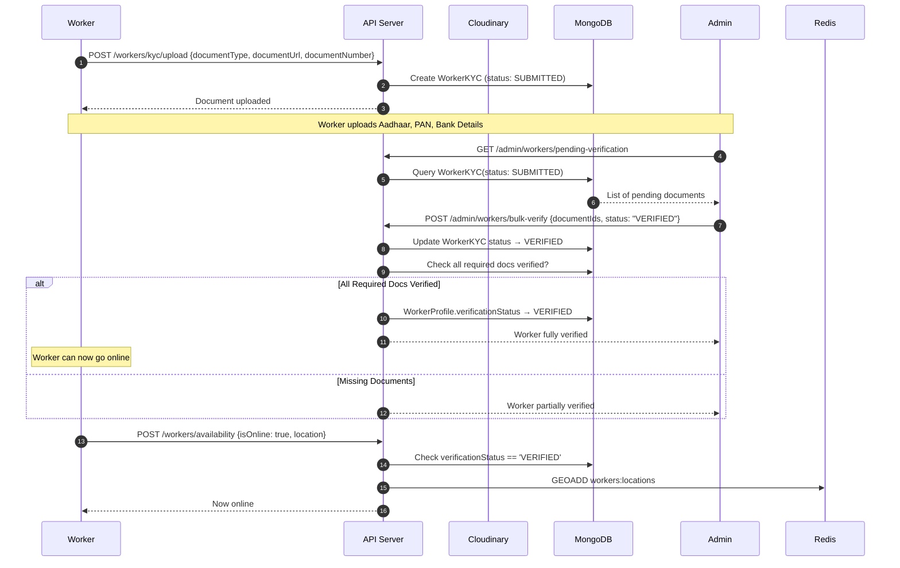
```mermaid
sequenceDiagram
    autonumber
    participant W as Worker
    participant API as API Server
    participant Cloud as Cloudinary
    participant DB as MongoDB
    participant A as Admin

    W->>API: POST /workers/kyc/upload {documentType, documentUrl, documentNumber}
    API->>DB: Create WorkerKYC (status: SUBMITTED)
    API-->>W: Document uploaded

    Note over W, A: Worker uploads Aadhaar, PAN, Bank Details

    A->>API: GET /admin/workers/pending-verification
    API->>DB: Query WorkerKYC(status: SUBMITTED)
    DB-->>A: List of pending documents

    A->>API: POST /admin/workers/bulk-verify {documentIds, status: "VERIFIED"}
    API->>DB: Update WorkerKYC status → VERIFIED
    API->>DB: Check all required docs verified?
    
    alt All Required Docs Verified
        API->>DB: WorkerProfile.verificationStatus → VERIFIED
        API-->>A: Worker fully verified
        Note over W: Worker can now go online
    else Missing Documents
        API-->>A: Worker partially verified
    end

    W->>API: POST /workers/availability {isOnline: true, location}
    API->>DB: Check verificationStatus == 'VERIFIED'
    API->>Redis: GEOADD workers:locations
    API-->>W: Now online
```

---

## 6. Rating & Wilson Score Flow

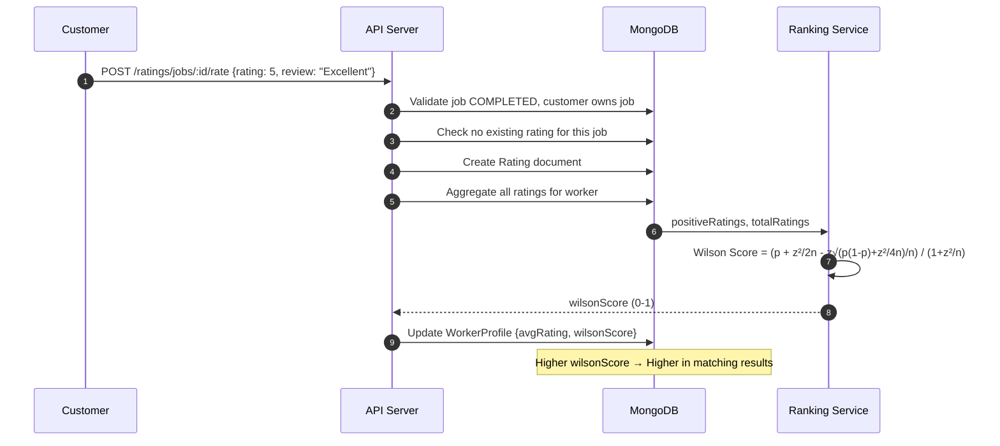
```mermaid
sequenceDiagram
    autonumber
    participant C as Customer
    participant API as API Server
    participant DB as MongoDB
    participant Ranking as Ranking Service

    C->>API: POST /ratings/jobs/:id/rate {rating: 5, review: "Excellent"}
    API->>DB: Validate job COMPLETED, customer owns job
    API->>DB: Check no existing rating for this job
    API->>DB: Create Rating document
    API->>DB: Aggregate all ratings for worker
    
    DB->>Ranking: positiveRatings, totalRatings
    Ranking->>Ranking: Wilson Score = (p + z²/2n - z√(p(1-p)+z²/4n)/n) / (1+z²/n)
    Ranking-->>API: wilsonScore (0-1)
    
    API->>DB: Update WorkerProfile {avgRating, wilsonScore}
    Note over DB: Higher wilsonScore → Higher in matching results
```

---

## 7. Warranty Claim Flow

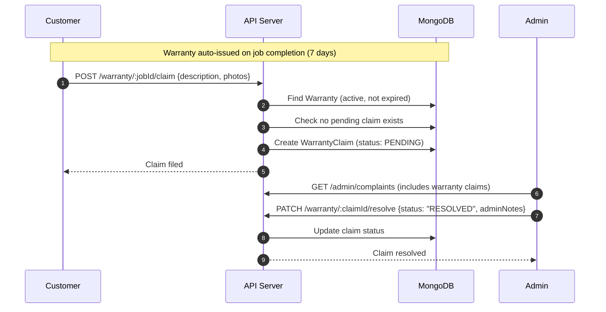
```mermaid
sequenceDiagram
    autonumber
    participant C as Customer
    participant API as API Server
    participant DB as MongoDB
    participant A as Admin

    Note over C, DB: Warranty auto-issued on job completion (7 days)

    C->>API: POST /warranty/:jobId/claim {description, photos}
    API->>DB: Find Warranty (active, not expired)
    API->>DB: Check no pending claim exists
    API->>DB: Create WarrantyClaim (status: PENDING)
    API-->>C: Claim filed

    A->>API: GET /admin/complaints (includes warranty claims)
    A->>API: PATCH /warranty/:claimId/resolve {status: "RESOLVED", adminNotes}
    API->>DB: Update claim status
    API-->>A: Claim resolved
```

---

## 8. Admin Live Operations Flow

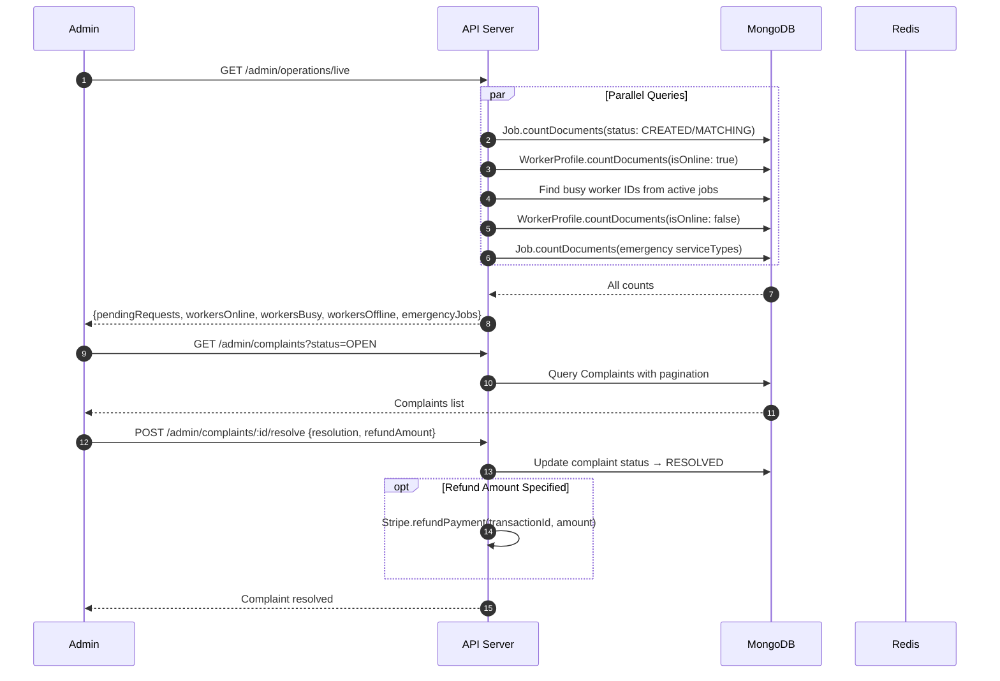
```mermaid
sequenceDiagram
    autonumber
    participant A as Admin
    participant API as API Server
    participant DB as MongoDB
    participant Redis

    A->>API: GET /admin/operations/live
    par Parallel Queries
        API->>DB: Job.countDocuments(status: CREATED/MATCHING)
        API->>DB: WorkerProfile.countDocuments(isOnline: true)
        API->>DB: Find busy worker IDs from active jobs
        API->>DB: WorkerProfile.countDocuments(isOnline: false)
        API->>DB: Job.countDocuments(emergency serviceTypes)
    end
    DB-->>API: All counts
    API-->>A: {pendingRequests, workersOnline, workersBusy, workersOffline, emergencyJobs}

    A->>API: GET /admin/complaints?status=OPEN
    API->>DB: Query Complaints with pagination
    DB-->>A: Complaints list

    A->>API: POST /admin/complaints/:id/resolve {resolution, refundAmount}
    API->>DB: Update complaint status → RESOLVED
    opt Refund Amount Specified
        API->>API: Stripe.refundPayment(transactionId, amount)
    end
    API-->>A: Complaint resolved
```

---

## 9. Field Executive Daily Flow

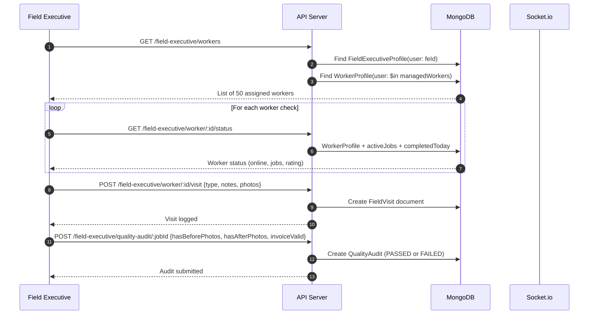
```mermaid
sequenceDiagram
    autonumber
    participant FE as Field Executive
    participant API as API Server
    participant DB as MongoDB
    participant S as Socket.io

    FE->>API: GET /field-executive/workers
    API->>DB: Find FieldExecutiveProfile(user: feId)
    API->>DB: Find WorkerProfile(user: $in managedWorkers)
    DB-->>FE: List of 50 assigned workers

    loop For each worker check
        FE->>API: GET /field-executive/worker/:id/status
        API->>DB: WorkerProfile + activeJobs + completedToday
        DB-->>FE: Worker status (online, jobs, rating)
    end

    FE->>API: POST /field-executive/worker/:id/visit {type, notes, photos}
    API->>DB: Create FieldVisit document
    API-->>FE: Visit logged

    FE->>API: POST /field-executive/quality-audit/:jobId {hasBeforePhotos, hasAfterPhotos, invoiceValid}
    API->>DB: Create QualityAudit (PASSED or FAILED)
    API-->>FE: Audit submitted
```

---

## 10. Zone Manager Supply/Demand Flow

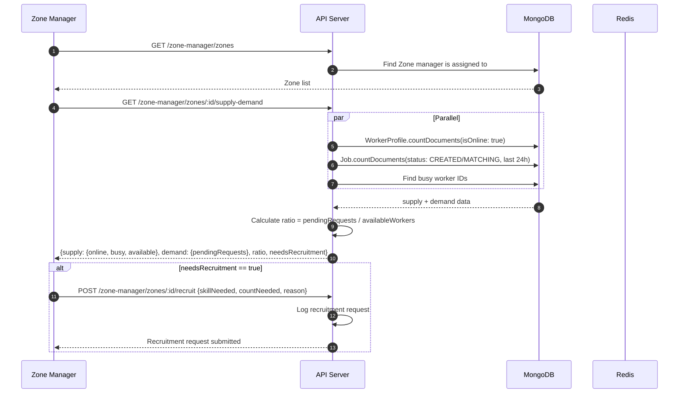
```mermaid
sequenceDiagram
    autonumber
    participant ZM as Zone Manager
    participant API as API Server
    participant DB as MongoDB
    participant Redis

    ZM->>API: GET /zone-manager/zones
    API->>DB: Find Zone manager is assigned to
    DB-->>ZM: Zone list

    ZM->>API: GET /zone-manager/zones/:id/supply-demand
    par Parallel
        API->>DB: WorkerProfile.countDocuments(isOnline: true)
        API->>DB: Job.countDocuments(status: CREATED/MATCHING, last 24h)
        API->>DB: Find busy worker IDs
    end
    DB-->>API: supply + demand data
    API->>API: Calculate ratio = pendingRequests / availableWorkers
    API-->>ZM: {supply: {online, busy, available}, demand: {pendingRequests}, ratio, needsRecruitment}

    alt needsRecruitment == true
        ZM->>API: POST /zone-manager/zones/:id/recruit {skillNeeded, countNeeded, reason}
        API->>API: Log recruitment request
        API-->>ZM: Recruitment request submitted
    end
```

---

## 11. City Manager Dashboard Flow

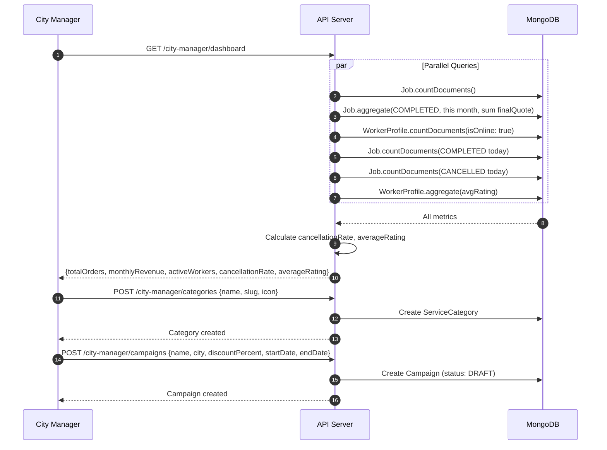
```mermaid
sequenceDiagram
    autonumber
    participant CM as City Manager
    participant API as API Server
    participant DB as MongoDB

    CM->>API: GET /city-manager/dashboard
    par Parallel Queries
        API->>DB: Job.countDocuments()
        API->>DB: Job.aggregate(COMPLETED, this month, sum finalQuote)
        API->>DB: WorkerProfile.countDocuments(isOnline: true)
        API->>DB: Job.countDocuments(COMPLETED today)
        API->>DB: Job.countDocuments(CANCELLED today)
        API->>DB: WorkerProfile.aggregate(avgRating)
    end
    DB-->>API: All metrics
    API->>API: Calculate cancellationRate, averageRating
    API-->>CM: {totalOrders, monthlyRevenue, activeWorkers, cancellationRate, averageRating}

    CM->>API: POST /city-manager/categories {name, slug, icon}
    API->>DB: Create ServiceCategory
    API-->>CM: Category created

    CM->>API: POST /city-manager/campaigns {name, city, discountPercent, startDate, endDate}
    API->>DB: Create Campaign (status: DRAFT)
    API-->>CM: Campaign created
```

---

## 12. Payment Processing Flow

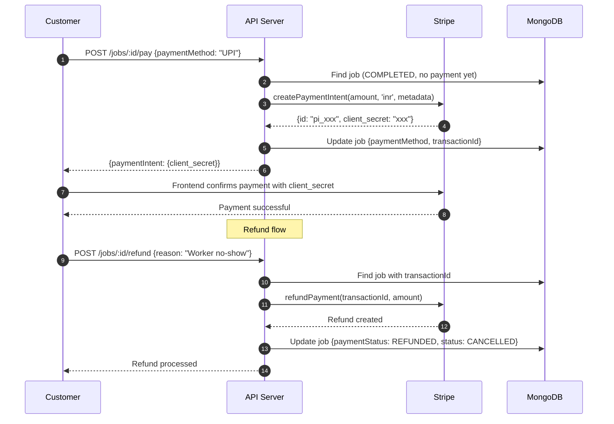
```mermaid
sequenceDiagram
    autonumber
    participant C as Customer
    participant API as API Server
    participant Stripe as Stripe
    participant DB as MongoDB

    C->>API: POST /jobs/:id/pay {paymentMethod: "UPI"}
    API->>DB: Find job (COMPLETED, no payment yet)
    API->>Stripe: createPaymentIntent(amount, 'inr', metadata)
    Stripe-->>API: {id: "pi_xxx", client_secret: "xxx"}
    API->>DB: Update job {paymentMethod, transactionId}
    API-->>C: {paymentIntent: {client_secret}}

    C->>Stripe: Frontend confirms payment with client_secret
    Stripe-->>C: Payment successful

    Note over API: Refund flow
    C->>API: POST /jobs/:id/refund {reason: "Worker no-show"}
    API->>DB: Find job with transactionId
    API->>Stripe: refundPayment(transactionId, amount)
    Stripe-->>API: Refund created
    API->>DB: Update job {paymentStatus: REFUNDED, status: CANCELLED}
    API-->>C: Refund processed
```

---

## 13. Email Queue Flow

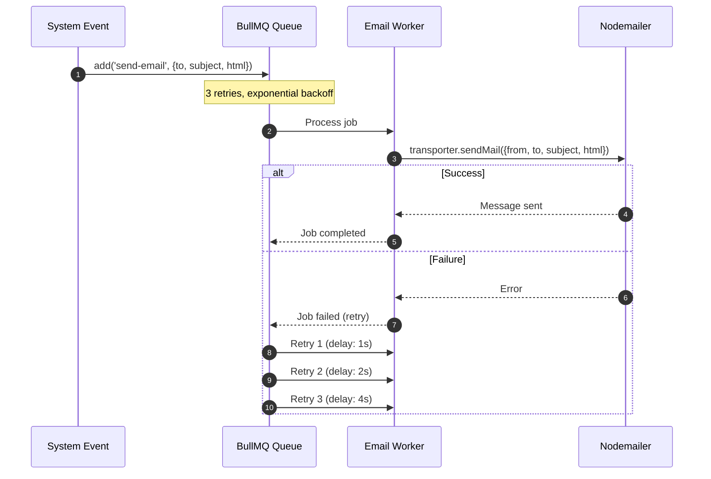
```mermaid
sequenceDiagram
    autonumber
    participant Event as System Event
    participant Queue as BullMQ Queue
    participant Worker as Email Worker
    participant SMTP as Nodemailer

    Event->>Queue: add('send-email', {to, subject, html})
    Note over Queue: 3 retries, exponential backoff
    
    Queue->>Worker: Process job
    Worker->>SMTP: transporter.sendMail({from, to, subject, html})
    
    alt Success
        SMTP-->>Worker: Message sent
        Worker-->>Queue: Job completed
    else Failure
        SMTP-->>Worker: Error
        Worker-->>Queue: Job failed (retry)
        Queue->>Worker: Retry 1 (delay: 1s)
        Queue->>Worker: Retry 2 (delay: 2s)
        Queue->>Worker: Retry 3 (delay: 4s)
    end
```

---

## 14. WebSocket Real-Time Events

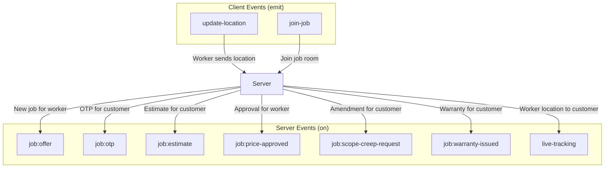
```mermaid
graph TD
    subgraph "Client Events (emit)"
        UL[update-location]
        JJ[join-job]
    end

    subgraph "Server Events (on)"
        JO[job:offer]
        JO2[job:otp]
        JO3[job:estimate]
        JO4[job:price-approved]
        JS[job:scope-creep-request]
        JW[job:warranty-issued]
        JT[live-tracking]
    end

    UL -->|Worker sends location| Server
    JJ -->|Join job room| Server
    Server -->|New job for worker| JO
    Server -->|OTP for customer| JO2
    Server -->|Estimate for customer| JO3
    Server -->|Approval for worker| JO4
    Server -->|Amendment for customer| JS
    Server -->|Warranty for customer| JW
    Server -->|Worker location to customer| JT
```
