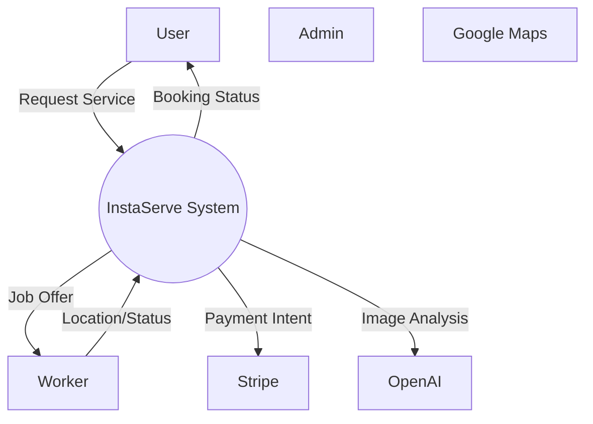
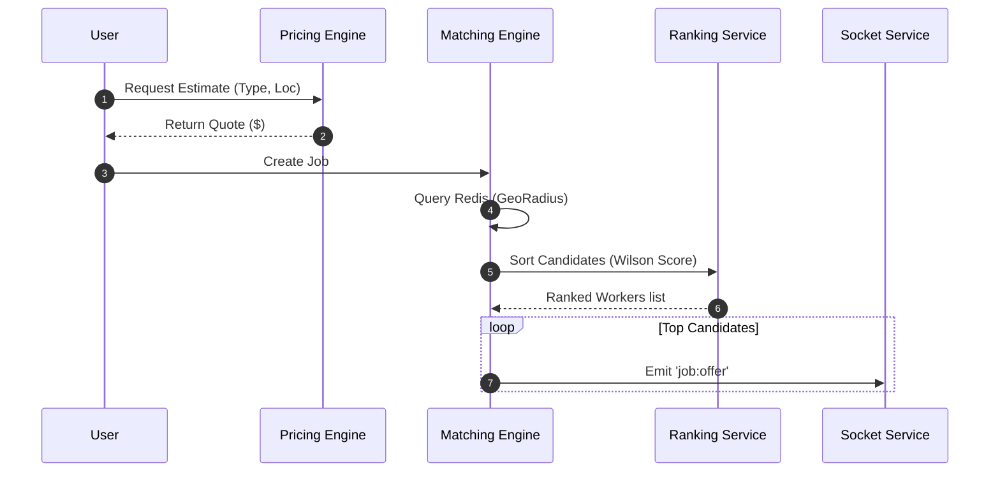

# Data Flow Diagrams (DFD)

This document details the flow of data and control through the components.

## 1. System Context (Level 0)

The high-level exchange of data between the System and External Entities.

## 2. Job Processing Data Flow (Level 1)

Data flow for calculating price, finding workers, and managing state.

