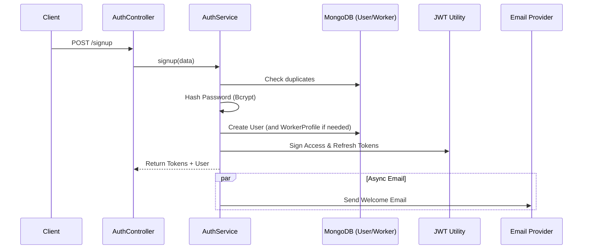
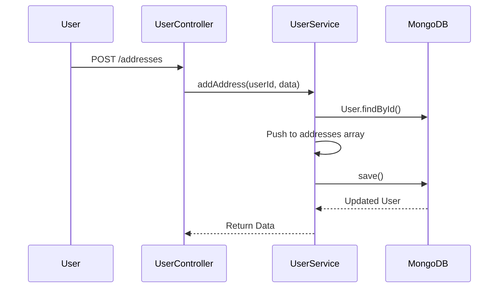
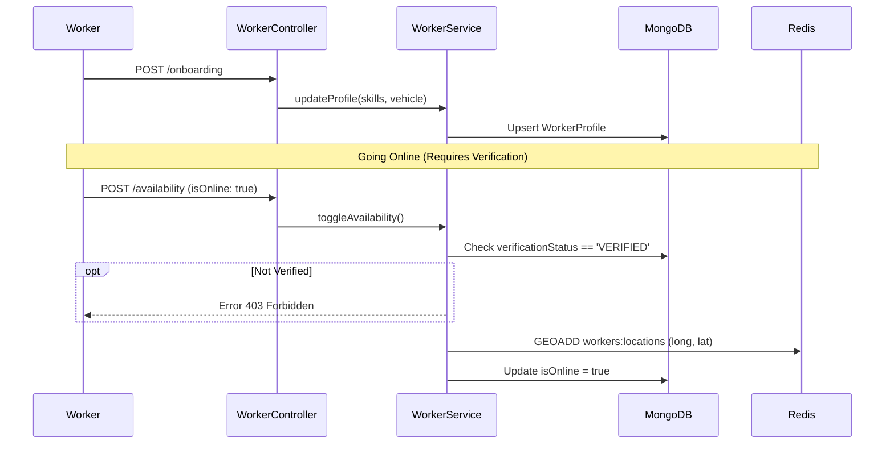
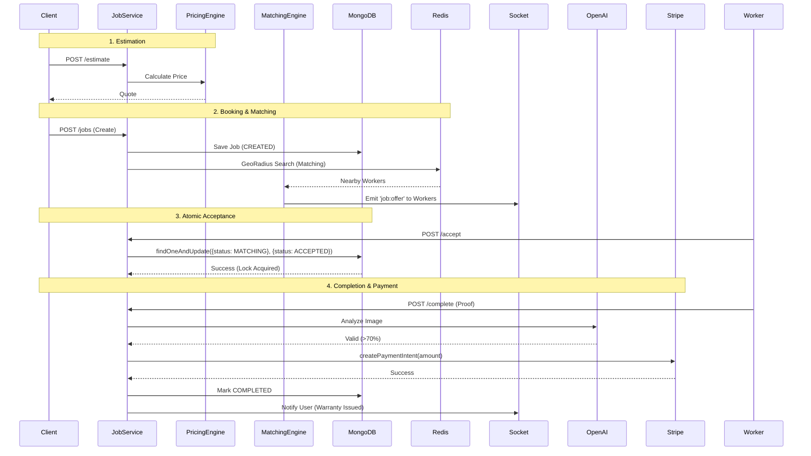
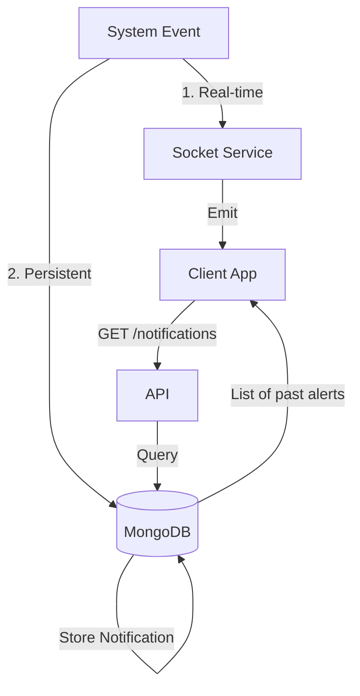
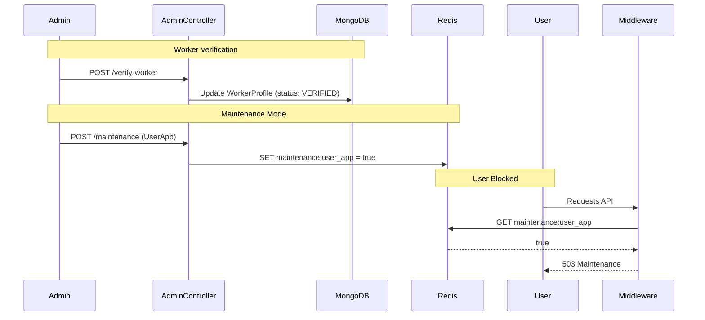

# Data Flow Diagrams (DFD)

This document details the flow of data and control through each micro-service/module within the InstaServe platform.

## 1. Auth Service Flow
Handles registration, login, and token generation.

## 2. User Service Flow
Manages profile and address data.

## 3. Worker Service Flow (Onboarding & Availability)
Shows the path from signup to being "Online" (Redis).

## 4. Job Service Flow (Full Lifecycle)
The core logic engine.

## 5. Notification Service Flow
Handles Real-time (Socket) vs Persistent (REST) notifications.

## 6. Admin Service Flow
Verification and System Control.

