# Data Flow Diagrams (DFD)

Detailed data flow through each module of the Oddigo v2 platform.

---

## 1. Auth Service Flow (Password + OTP)

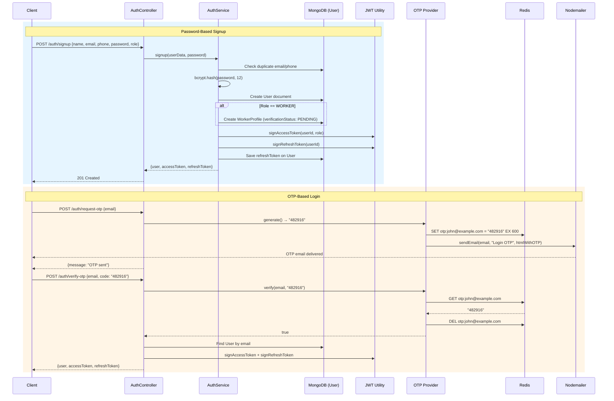
```mermaid
sequenceDiagram
    participant Client
    participant AuthController
    participant AuthService
    participant DB as MongoDB (User)
    participant JWT as JWT Utility
    participant OTP as OTP Provider
    participant Redis
    participant Email as Nodemailer

    rect rgb(230, 245, 255)
    Note over Client, JWT: Password-Based Signup
    Client->>AuthController: POST /auth/signup {name, email, phone, password, role}
    AuthController->>AuthService: signup(userData, password)
    AuthService->>DB: Check duplicate email/phone
    AuthService->>AuthService: bcrypt.hash(password, 12)
    AuthService->>DB: Create User document
    alt Role == WORKER
        AuthService->>DB: Create WorkerProfile (verificationStatus: PENDING)
    end
    AuthService->>JWT: signAccessToken(userId, role)
    AuthService->>JWT: signRefreshToken(userId)
    AuthService->>DB: Save refreshToken on User
    AuthService-->>AuthController: {user, accessToken, refreshToken}
    AuthController-->>Client: 201 Created
    end

    rect rgb(255, 245, 230)
    Note over Client, Email: OTP-Based Login
    Client->>AuthController: POST /auth/request-otp {email}
    AuthController->>OTP: generate() → "482916"
    OTP->>Redis: SET otp:john@example.com = "482916" EX 600
    OTP->>Email: sendEmail(email, "Login OTP", htmlWithOTP)
    Email-->>Client: OTP email delivered
    AuthController-->>Client: {message: "OTP sent"}

    Client->>AuthController: POST /auth/verify-otp {email, code: "482916"}
    AuthController->>OTP: verify(email, "482916")
    OTP->>Redis: GET otp:john@example.com
    Redis-->>OTP: "482916"
    OTP->>Redis: DEL otp:john@example.com
    OTP-->>AuthController: true
    AuthController->>DB: Find User by email
    AuthController->>JWT: signAccessToken + signRefreshToken
    AuthController-->>Client: {user, accessToken, refreshToken}
    end
```

---

## 2. Service Catalog Data Flow

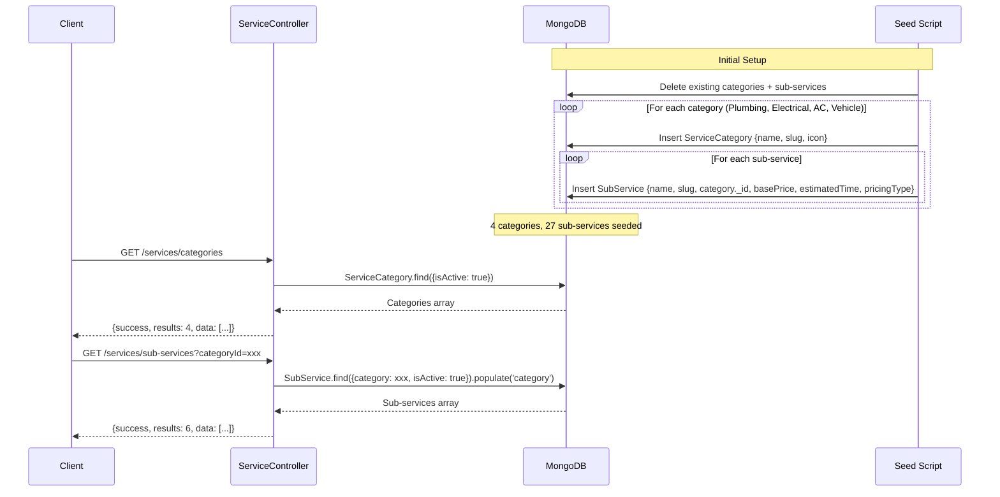
```mermaid
sequenceDiagram
    participant Client
    participant ServiceController
    participant DB as MongoDB
    participant Seed as Seed Script

    Note over Seed, DB: Initial Setup
    Seed->>DB: Delete existing categories + sub-services
    loop For each category (Plumbing, Electrical, AC, Vehicle)
        Seed->>DB: Insert ServiceCategory {name, slug, icon}
        loop For each sub-service
            Seed->>DB: Insert SubService {name, slug, category._id, basePrice, estimatedTime, pricingType}
        end
    end
    Note over DB: 4 categories, 27 sub-services seeded

    Client->>ServiceController: GET /services/categories
    ServiceController->>DB: ServiceCategory.find({isActive: true})
    DB-->>ServiceController: Categories array
    ServiceController-->>Client: {success, results: 4, data: [...]}

    Client->>ServiceController: GET /services/sub-services?categoryId=xxx
    ServiceController->>DB: SubService.find({category: xxx, isActive: true}).populate('category')
    DB-->>ServiceController: Sub-services array
    ServiceController-->>Client: {success, results: 6, data: [...]}
```

---

## 3. Pricing Engine Data Flow

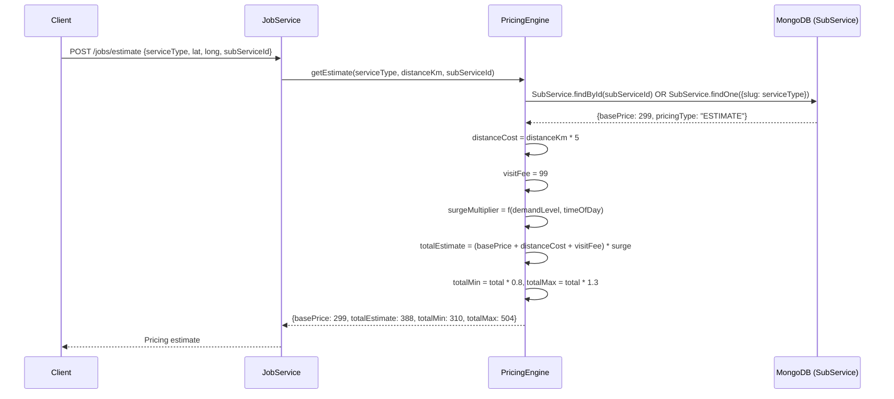
```mermaid
sequenceDiagram
    participant Client
    participant JobService
    participant Pricing as PricingEngine
    participant DB as MongoDB (SubService)

    Client->>JobService: POST /jobs/estimate {serviceType, lat, long, subServiceId}
    JobService->>Pricing: getEstimate(serviceType, distanceKm, subServiceId)

    Pricing->>DB: SubService.findById(subServiceId) OR SubService.findOne({slug: serviceType})
    DB-->>Pricing: {basePrice: 299, pricingType: "ESTIMATE"}
    
    Pricing->>Pricing: distanceCost = distanceKm * 5
    Pricing->>Pricing: visitFee = 99
    Pricing->>Pricing: surgeMultiplier = f(demandLevel, timeOfDay)
    Pricing->>Pricing: totalEstimate = (basePrice + distanceCost + visitFee) * surge
    Pricing->>Pricing: totalMin = total * 0.8, totalMax = total * 1.3

    Pricing-->>JobService: {basePrice: 299, totalEstimate: 388, totalMin: 310, totalMax: 504}
    JobService-->>Client: Pricing estimate
```

---

## 4. Job Lifecycle Data Flow

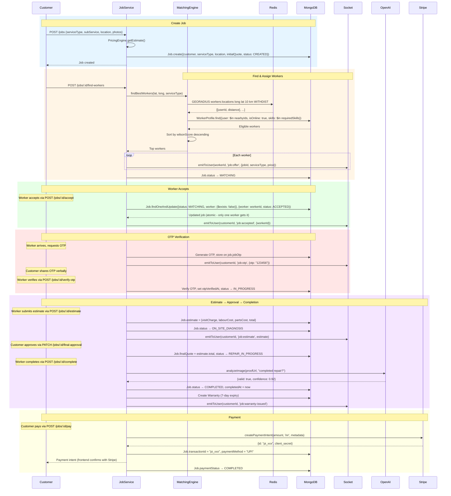
```mermaid
sequenceDiagram
    participant C as Customer
    participant JS as JobService
    participant ME as MatchingEngine
    participant Redis
    participant DB as MongoDB
    participant Socket
    participant AI as OpenAI
    participant Stripe

    rect rgb(230, 245, 255)
    Note over C, DB: Create Job
    C->>JS: POST /jobs {serviceType, subService, location, photos}
    JS->>JS: PricingEngine.getEstimate()
    JS->>DB: Job.create({customer, serviceType, location, initialQuote, status: CREATED})
    JS-->>C: Job created
    end

    rect rgb(255, 245, 230)
    Note over ME, Socket: Find & Assign Workers
    C->>JS: POST /jobs/:id/find-workers
    JS->>ME: findBestWorkers(lat, long, serviceType)
    ME->>Redis: GEORADIUS workers:locations long lat 10 km WITHDIST
    Redis-->>ME: [[userId, distance], ...]
    ME->>DB: WorkerProfile.find({user: $in nearbyIds, isOnline: true, skills: $in requiredSkills})
    DB-->>ME: Eligible workers
    ME->>ME: Sort by wilsonScore descending
    ME-->>JS: Top workers
    loop Each worker
        JS->>Socket: emitToUser(workerId, 'job:offer', {jobId, serviceType, price})
    end
    JS->>DB: Job.status → MATCHING
    end

    rect rgb(230, 255, 230)
    Note over C, DB: Worker Accepts
    Note over C: Worker accepts via POST /jobs/:id/accept
    JS->>DB: Job.findOneAndUpdate({status: MATCHING, worker: {$exists: false}}, {worker: workerId, status: ACCEPTED})
    DB-->>JS: Updated job (atomic - only one worker gets it)
    JS->>Socket: emitToUser(customerId, 'job:accepted', {workerId})
    end

    rect rgb(255, 230, 230)
    Note over C, DB: OTP Verification
    Note over C: Worker arrives, requests OTP
    JS->>DB: Generate OTP, store on job.jobOtp
    JS->>Socket: emitToUser(customerId, 'job:otp', {otp: "123456"})
    Note over C: Customer shares OTP verbally
    Note over C: Worker verifies via POST /jobs/:id/verify-otp
    JS->>DB: Verify OTP, set otpVerifiedAt, status → IN_PROGRESS
    end

    rect rgb(245, 230, 255)
    Note over C, Stripe: Estimate → Approval → Completion
    Note over C: Worker submits estimate via POST /jobs/:id/estimate
    JS->>DB: Job.estimate = {visitCharge, labourCost, partsCost, total}
    JS->>DB: Job.status → ON_SITE_DIAGNOSIS
    JS->>Socket: emitToUser(customerId, 'job:estimate', estimate)

    Note over C: Customer approves via PATCH /jobs/:id/final-approval
    JS->>DB: Job.finalQuote = estimate.total, status → REPAIR_IN_PROGRESS

    Note over C: Worker completes via POST /jobs/:id/complete
    JS->>AI: analyzeImage(proofUrl, "completed repair?")
    AI-->>JS: {valid: true, confidence: 0.92}
    JS->>DB: Job.status → COMPLETED, completedAt = now
    JS->>DB: Create Warranty (7-day expiry)
    JS->>Socket: emitToUser(customerId, 'job:warranty-issued')
    end

    rect rgb(255, 255, 230)
    Note over C, Stripe: Payment
    Note over C: Customer pays via POST /jobs/:id/pay
    JS->>Stripe: createPaymentIntent(amount, 'inr', metadata)
    Stripe-->>JS: {id: "pi_xxx", client_secret}
    JS->>DB: Job.transactionId = "pi_xxx", paymentMethod = "UPI"
    JS-->>C: Payment intent (frontend confirms with Stripe)
    JS->>DB: Job.paymentStatus → COMPLETED
    end
```

---

## 5. Rating & Wilson Score Data Flow

```mermaid
sequenceDiagram
    participant C as Customer
    participant RS as RatingService
    participant DB as MongoDB
    participant WS as Wilson Score Calculator

    C->>RS: POST /ratings/jobs/:id/rate {rating: 5, review: "Great"}
    RS->>DB: Job.findById(jobId) — verify COMPLETED, customer owns it
    RS->>DB: Rating.findOne({job: jobId}) — check no duplicate
    RS->>DB: Rating.create({job, customer, worker, rating: 5, review})
    
    RS->>DB: Rating.aggregate([
        {$match: {worker: workerId}},
        {$group: {_id: null, avgRating: {$avg: '$rating'}, totalRatings: {$sum: 1}, positiveRatings: {$sum: {$cond: [{$gte: ['$rating', 4]}, 1, 0]}}}}
    ])
    DB-->>RS: {avgRating: 4.3, totalRatings: 20, positiveRatings: 17}

    RS->>WS: calculateWilsonScore(positive=17, total=20)
    WS->>WS: p = 17/20 = 0.85
    WS->>WS: z = 1.96 (95% confidence)
    WS->>WS: wilsonScore = (0.85 + 1.96²/40 - 1.96*sqrt((0.85*0.15+1.96²/80)/20)) / (1+1.96²/20)
    WS-->>RS: 0.7123

    RS->>DB: WorkerProfile.findOneAndUpdate({user: workerId}, {avgRating: 4.3, wilsonScore: 0.7123})
    Note over DB: Higher wilsonScore = higher ranking in MatchingEngine
```

---

## 6. Worker Geo-Location Data Flow

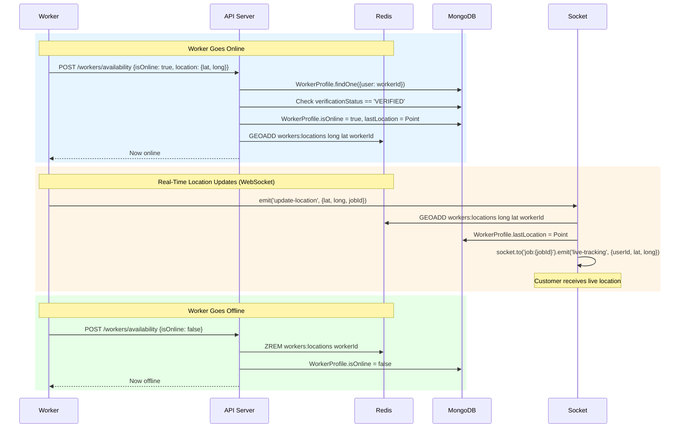
```mermaid
sequenceDiagram
    participant W as Worker
    participant API as API Server
    participant Redis
    participant DB as MongoDB
    participant Socket

    rect rgb(230, 245, 255)
    Note over W, Redis: Worker Goes Online
    W->>API: POST /workers/availability {isOnline: true, location: {lat, long}}
    API->>DB: WorkerProfile.findOne({user: workerId})
    API->>DB: Check verificationStatus == 'VERIFIED'
    API->>DB: WorkerProfile.isOnline = true, lastLocation = Point
    API->>Redis: GEOADD workers:locations long lat workerId
    API-->>W: Now online
    end

    rect rgb(255, 245, 230)
    Note over W, Redis: Real-Time Location Updates (WebSocket)
    W->>Socket: emit('update-location', {lat, long, jobId})
    Socket->>Redis: GEOADD workers:locations long lat workerId
    Socket->>DB: WorkerProfile.lastLocation = Point
    Socket->>Socket: socket.to('job:{jobId}').emit('live-tracking', {userId, lat, long})
    Note over Socket: Customer receives live location
    end

    rect rgb(230, 255, 230)
    Note over W, Redis: Worker Goes Offline
    W->>API: POST /workers/availability {isOnline: false}
    API->>Redis: ZREM workers:locations workerId
    API->>DB: WorkerProfile.isOnline = false
    API-->>W: Now offline
    end
```

---

## 7. KYC Verification Data Flow

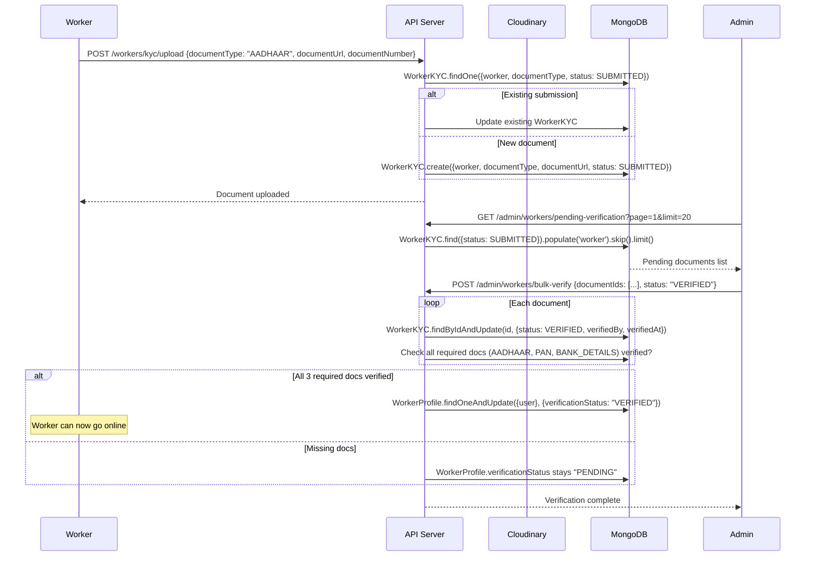
```mermaid
sequenceDiagram
    participant W as Worker
    participant API as API Server
    participant Cloud as Cloudinary
    participant DB as MongoDB
    participant A as Admin

    W->>API: POST /workers/kyc/upload {documentType: "AADHAAR", documentUrl, documentNumber}
    API->>DB: WorkerKYC.findOne({worker, documentType, status: SUBMITTED})
    alt Existing submission
        API->>DB: Update existing WorkerKYC
    else New document
        API->>DB: WorkerKYC.create({worker, documentType, documentUrl, status: SUBMITTED})
    end
    API-->>W: Document uploaded

    A->>API: GET /admin/workers/pending-verification?page=1&limit=20
    API->>DB: WorkerKYC.find({status: SUBMITTED}).populate('worker').skip().limit()
    DB-->>A: Pending documents list

    A->>API: POST /admin/workers/bulk-verify {documentIds: [...], status: "VERIFIED"}
    loop Each document
        API->>DB: WorkerKYC.findByIdAndUpdate(id, {status: VERIFIED, verifiedBy, verifiedAt})
        API->>DB: Check all required docs (AADHAAR, PAN, BANK_DETAILS) verified?
    end
    
    alt All 3 required docs verified
        API->>DB: WorkerProfile.findOneAndUpdate({user}, {verificationStatus: "VERIFIED"})
        Note over W: Worker can now go online
    else Missing docs
        API->>DB: WorkerProfile.verificationStatus stays "PENDING"
    end
    API-->>A: Verification complete
```

---

## 8. Complaint & Refund Data Flow

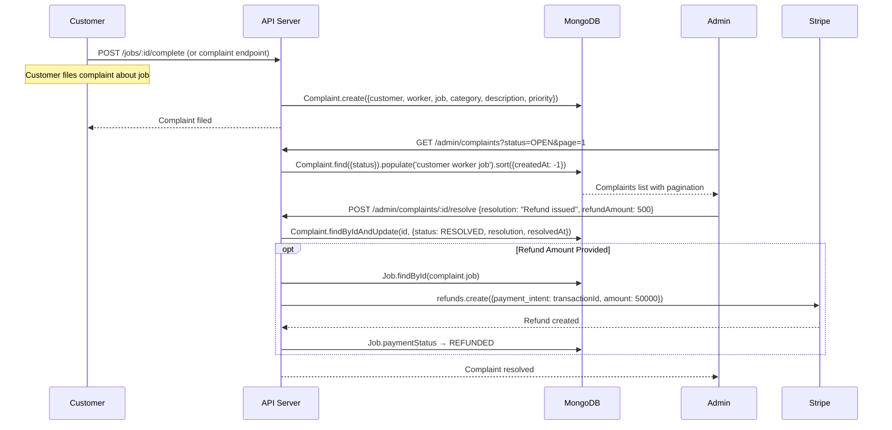
```mermaid
sequenceDiagram
    participant C as Customer
    participant API as API Server
    participant DB as MongoDB
    participant A as Admin
    participant Stripe

    C->>API: POST /jobs/:id/complete (or complaint endpoint)
    Note over C: Customer files complaint about job
    API->>DB: Complaint.create({customer, worker, job, category, description, priority})
    API-->>C: Complaint filed

    A->>API: GET /admin/complaints?status=OPEN&page=1
    API->>DB: Complaint.find({status}).populate('customer worker job').sort({createdAt: -1})
    DB-->>A: Complaints list with pagination

    A->>API: POST /admin/complaints/:id/resolve {resolution: "Refund issued", refundAmount: 500}
    API->>DB: Complaint.findByIdAndUpdate(id, {status: RESOLVED, resolution, resolvedAt})
    
    opt Refund Amount Provided
        API->>DB: Job.findById(complaint.job)
        API->>Stripe: refunds.create({payment_intent: transactionId, amount: 50000})
        Stripe-->>API: Refund created
        API->>DB: Job.paymentStatus → REFUNDED
    end
    API-->>A: Complaint resolved
```

---

## 9. Notification & Email Data Flow

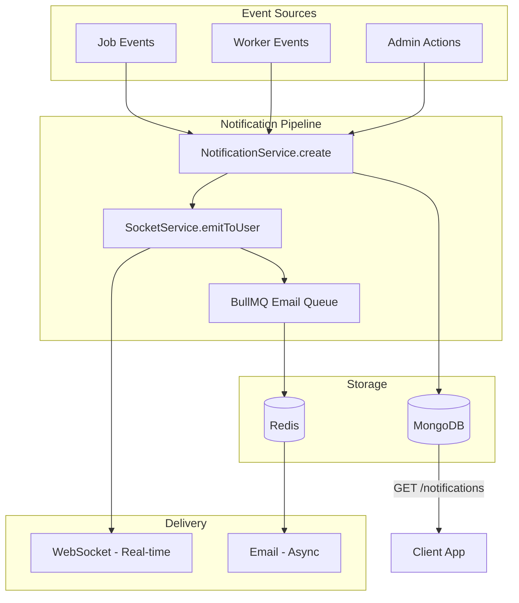
```mermaid
graph TD
    subgraph "Event Sources"
        JE[Job Events]
        WE[Worker Events]
        AE[Admin Actions]
    end

    subgraph "Notification Pipeline"
        NS[NotificationService.create]
        SS[SocketService.emitToUser]
        BQ[BullMQ Email Queue]
    end

    subgraph "Storage"
        MongoDB[(MongoDB)]
        Redis[(Redis)]
    end

    subgraph "Delivery"
        WS[WebSocket - Real-time]
        EMAIL[Email - Async]
    end

    JE --> NS
    WE --> NS
    AE --> NS

    NS --> MongoDB
    NS --> SS

    SS --> WS
    SS --> BQ

    BQ --> Redis
    Redis --> EMAIL

    MongoDB -->|GET /notifications| Client[Client App]
```

---

## 10. Maintenance Mode Data Flow

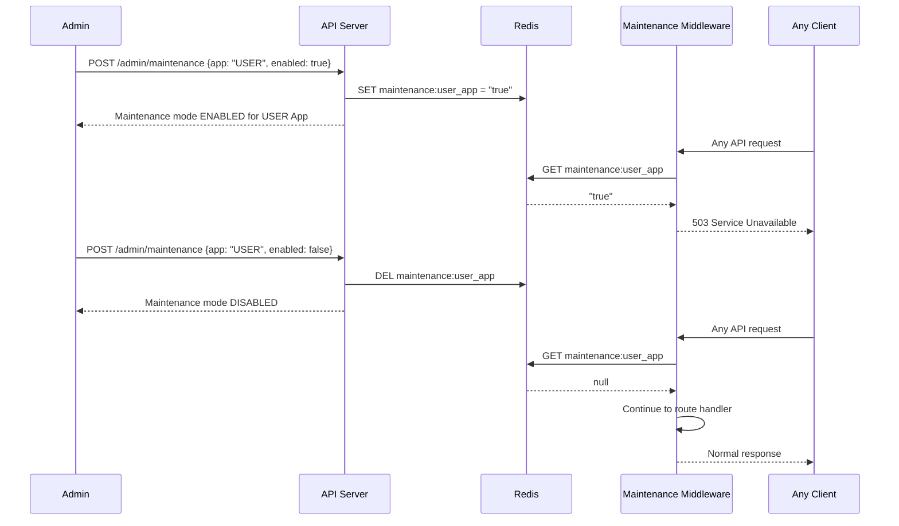
```mermaid
sequenceDiagram
    participant A as Admin
    participant API as API Server
    participant Redis
    participant MW as Maintenance Middleware
    participant C as Any Client

    A->>API: POST /admin/maintenance {app: "USER", enabled: true}
    API->>Redis: SET maintenance:user_app = "true"
    API-->>A: Maintenance mode ENABLED for USER App

    C->>MW: Any API request
    MW->>Redis: GET maintenance:user_app
    Redis-->>MW: "true"
    MW-->>C: 503 Service Unavailable

    A->>API: POST /admin/maintenance {app: "USER", enabled: false}
    API->>Redis: DEL maintenance:user_app
    API-->>A: Maintenance mode DISABLED

    C->>MW: Any API request
    MW->>Redis: GET maintenance:user_app
    Redis-->>MW: null
    MW->>MW: Continue to route handler
    MW-->>C: Normal response
```

---

## 11. Payment Transaction Data Flow

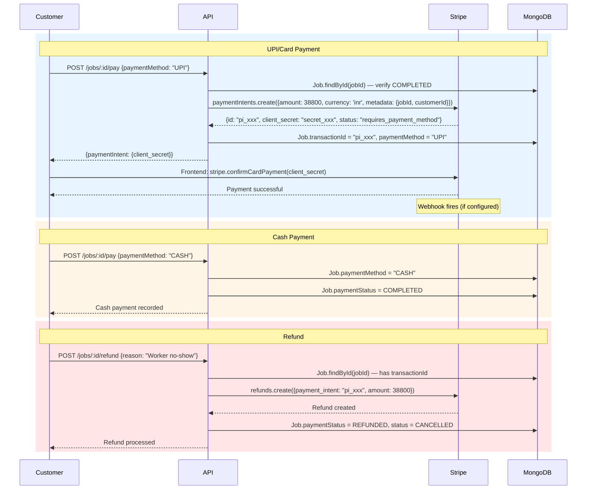
```mermaid
sequenceDiagram
    participant C as Customer
    participant API as API
    participant Stripe
    participant DB as MongoDB

    rect rgb(230, 245, 255)
    Note over C, DB: UPI/Card Payment
    C->>API: POST /jobs/:id/pay {paymentMethod: "UPI"}
    API->>DB: Job.findById(jobId) — verify COMPLETED
    API->>Stripe: paymentIntents.create({amount: 38800, currency: 'inr', metadata: {jobId, customerId}})
    Stripe-->>API: {id: "pi_xxx", client_secret: "secret_xxx", status: "requires_payment_method"}
    API->>DB: Job.transactionId = "pi_xxx", paymentMethod = "UPI"
    API-->>C: {paymentIntent: {client_secret}}
    C->>Stripe: Frontend: stripe.confirmCardPayment(client_secret)
    Stripe-->>C: Payment successful
    Note over Stripe: Webhook fires (if configured)
    end

    rect rgb(255, 245, 230)
    Note over C, DB: Cash Payment
    C->>API: POST /jobs/:id/pay {paymentMethod: "CASH"}
    API->>DB: Job.paymentMethod = "CASH"
    API->>DB: Job.paymentStatus = COMPLETED
    API-->>C: Cash payment recorded
    end

    rect rgb(255, 230, 230)
    Note over C, DB: Refund
    C->>API: POST /jobs/:id/refund {reason: "Worker no-show"}
    API->>DB: Job.findById(jobId) — has transactionId
    API->>Stripe: refunds.create({payment_intent: "pi_xxx", amount: 38800})
    Stripe-->>API: Refund created
    API->>DB: Job.paymentStatus = REFUNDED, status = CANCELLED
    API-->>C: Refund processed
    end
```

---

## 12. Campaign Data Flow

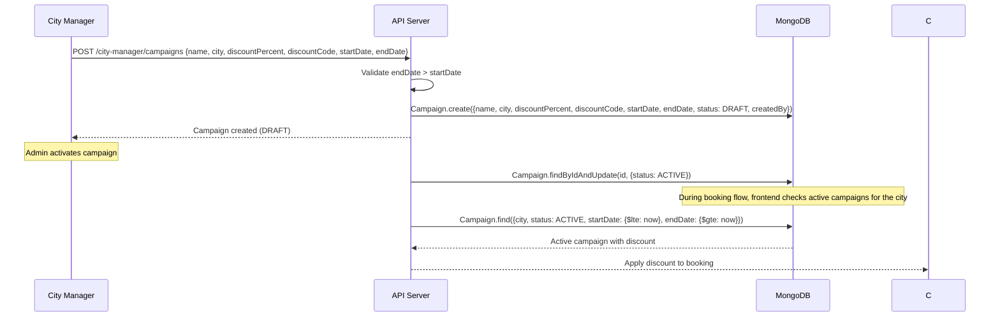
```mermaid
sequenceDiagram
    participant CM as City Manager
    participant API as API Server
    participant DB as MongoDB

    CM->>API: POST /city-manager/campaigns {name, city, discountPercent, discountCode, startDate, endDate}
    API->>API: Validate endDate > startDate
    API->>DB: Campaign.create({name, city, discountPercent, discountCode, startDate, endDate, status: DRAFT, createdBy})
    API-->>CM: Campaign created (DRAFT)

    Note over CM: Admin activates campaign
    API->>DB: Campaign.findByIdAndUpdate(id, {status: ACTIVE})
    
    Note over DB: During booking flow, frontend checks active campaigns for the city
    API->>DB: Campaign.find({city, status: ACTIVE, startDate: {$lte: now}, endDate: {$gte: now}})
    DB-->>API: Active campaign with discount
    API-->>C: Apply discount to booking
```

---

## 13. Zone & Recruitment Data Flow

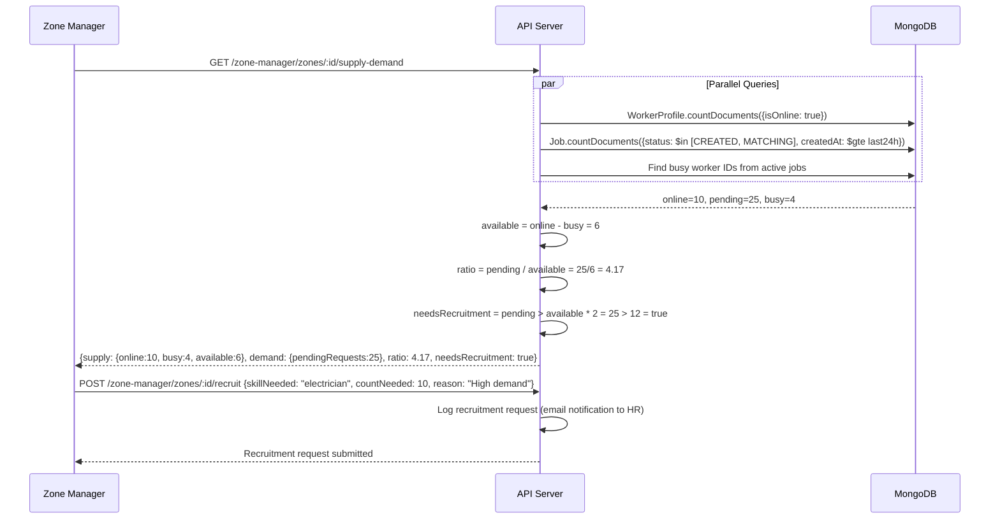
```mermaid
sequenceDiagram
    participant ZM as Zone Manager
    participant API as API Server
    participant DB as MongoDB

    ZM->>API: GET /zone-manager/zones/:id/supply-demand
    par Parallel Queries
        API->>DB: WorkerProfile.countDocuments({isOnline: true})
        API->>DB: Job.countDocuments({status: $in [CREATED, MATCHING], createdAt: $gte last24h})
        API->>DB: Find busy worker IDs from active jobs
    end
    DB-->>API: online=10, pending=25, busy=4
    API->>API: available = online - busy = 6
    API->>API: ratio = pending / available = 25/6 = 4.17
    API->>API: needsRecruitment = pending > available * 2 = 25 > 12 = true
    API-->>ZM: {supply: {online:10, busy:4, available:6}, demand: {pendingRequests:25}, ratio: 4.17, needsRecruitment: true}

    ZM->>API: POST /zone-manager/zones/:id/recruit {skillNeeded: "electrician", countNeeded: 10, reason: "High demand"}
    API->>API: Log recruitment request (email notification to HR)
    API-->>ZM: Recruitment request submitted
```

---

## 14. Socket.io Connection & Room Management

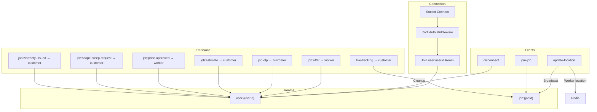
```mermaid
graph TD
    subgraph "Connection"
        SC[Socket Connect]
        Auth[JWT Auth Middleware]
        Room[Join user:userId Room]
    end

    subgraph "Events"
        UL[update-location]
        JJ[join-job]
        DC[disconnect]
    end

    subgraph "Rooms"
        UR["user:{userId}"]
        JR["job:{jobId}"]
    end

    SC --> Auth
    Auth --> Room
    Room --> UR

    UL -->|Worker location| Redis
    UL -->|Broadcast| JR

    JJ --> JR

    DC -->|Cleanup| UR

    subgraph "Emissions"
        JO[job:offer → worker]
        JP[job:otp → customer]
        JE[job:estimate → customer]
        JA[job:price-approved → worker]
        JS[job:scope-creep-request → customer]
        JW[job:warranty-issued → customer]
        JT[live-tracking → customer]
    end

    JO --> UR
    JP --> UR
    JE --> UR
    JA --> UR
    JS --> UR
    JW --> UR
    JT --> JR
```

---

## Database Schema Relationships

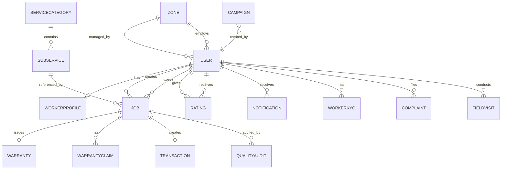
```mermaid
erDiagram
    USER ||--o| WORKERPROFILE : has
    USER ||--o{ JOB : creates
    USER ||--o{ JOB : works
    USER ||--o{ RATING : gives
    USER ||--o{ RATING : receives
    USER ||--o{ NOTIFICATION : receives
    USER ||--o{ WORKERKYC : has
    USER ||--o{ COMPLAINT : files
    USER ||--o{ FIELDVISIT : conducts

    SERVICECATEGORY ||--o{ SUBSERVICE : contains
    SUBSERVICE ||--o{ JOB : referenced_by

    JOB ||--o| WARRANTY : issues
    JOB ||--o{ WARRANTYCLAIM : has
    JOB ||--o| TRANSACTION : creates
    JOB ||--o{ QUALITYAUDIT : audited_by

    ZONE ||--o{ USER : managed_by
    ZONE ||--o{ USER : employs

    CAMPAIGN }o--|| USER : created_by
```
