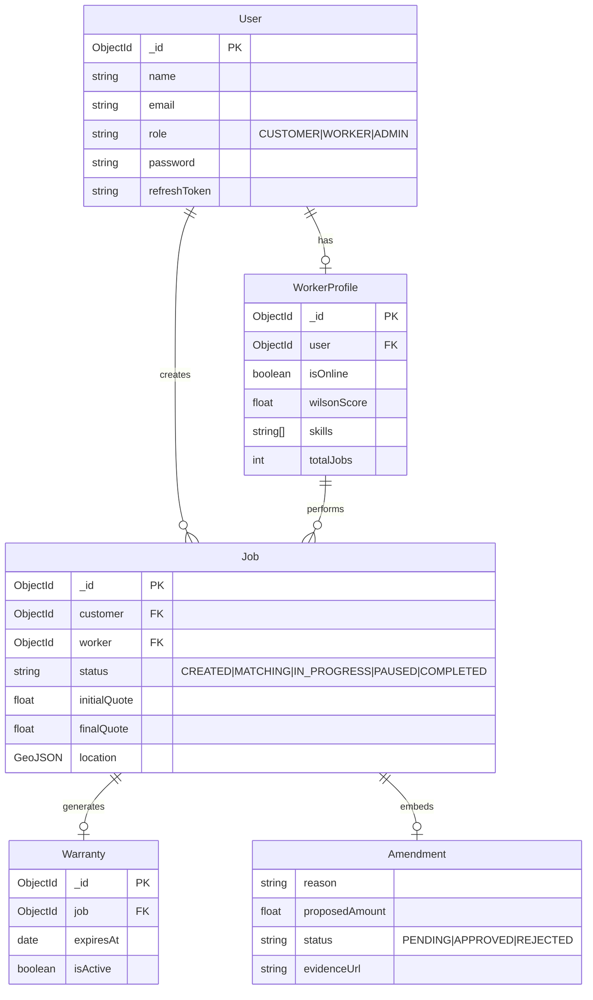

# Entity Relationship Diagrams (ERD)

This document breaks down the data models for different domains of the system.

## Unified System Schema

The complete overview including Warranty, Ranking, and Scope Creep extensions.

