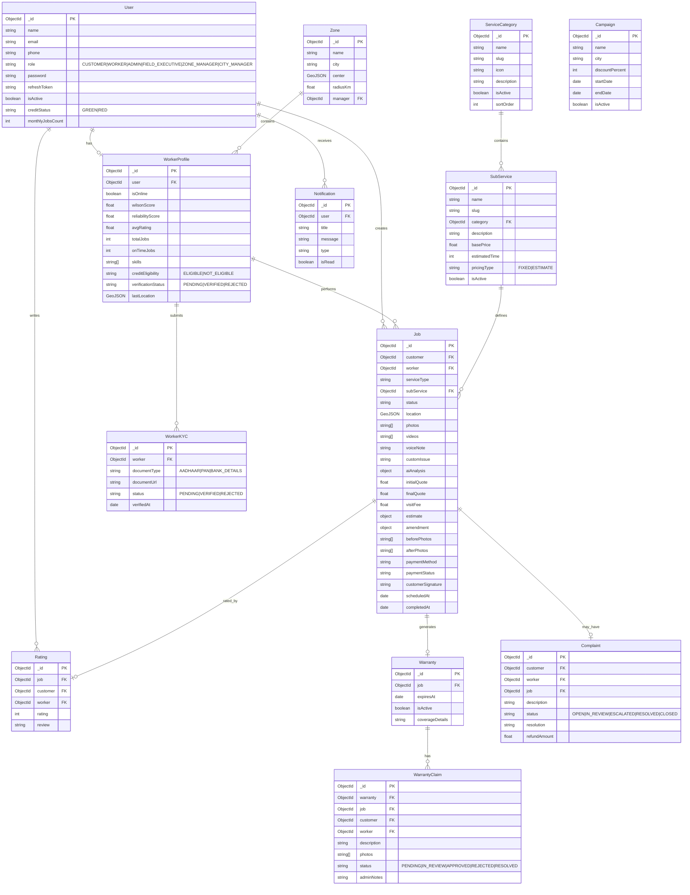
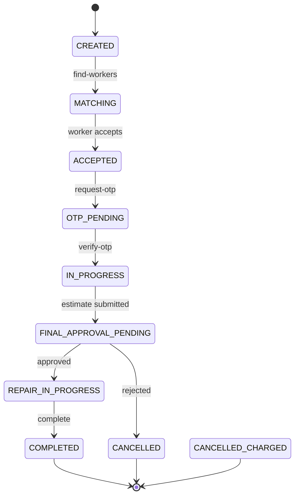
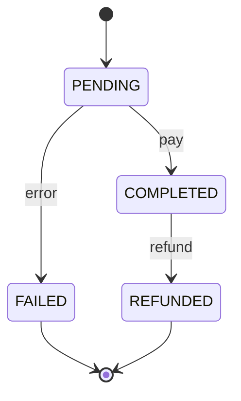

# Entity Relationship Diagrams (ERD)

Complete data model for the Oddigo v2 platform.

## Unified System Schema

```mermaid
erDiagram
    User {
        ObjectId _id PK
        string name
        string email
        string phone
        string role "CUSTOMER|WORKER|ADMIN|FIELD_EXECUTIVE|ZONE_MANAGER|CITY_MANAGER"
        string password
        string refreshToken
        boolean isActive
        string creditStatus "GREEN|RED"
        int monthlyJobsCount
    }

    WorkerProfile {
        ObjectId _id PK
        ObjectId user FK
        boolean isOnline
        float wilsonScore
        float reliabilityScore
        float avgRating
        int totalJobs
        int onTimeJobs
        string[] skills
        string creditEligibility "ELIGIBLE|NOT_ELIGIBLE"
        string verificationStatus "PENDING|VERIFIED|REJECTED"
        GeoJSON lastLocation
    }

    ServiceCategory {
        ObjectId _id PK
        string name
        string slug
        string icon
        string description
        boolean isActive
        int sortOrder
    }

    SubService {
        ObjectId _id PK
        string name
        string slug
        ObjectId category FK
        string description
        float basePrice
        int estimatedTime
        string pricingType "FIXED|ESTIMATE"
        boolean isActive
    }

    Job {
        ObjectId _id PK
        ObjectId customer FK
        ObjectId worker FK
        string serviceType
        ObjectId subService FK
        string status
        GeoJSON location
        string[] photos
        string[] videos
        string voiceNote
        string customIssue
        object aiAnalysis
        float initialQuote
        float finalQuote
        float visitFee
        object estimate
        object amendment
        string[] beforePhotos
        string[] afterPhotos
        string paymentMethod
        string paymentStatus
        string customerSignature
        date scheduledAt
        date completedAt
    }

    Rating {
        ObjectId _id PK
        ObjectId job FK
        ObjectId customer FK
        ObjectId worker FK
        int rating
        string review
    }

    Warranty {
        ObjectId _id PK
        ObjectId job FK
        date expiresAt
        boolean isActive
        string coverageDetails
    }

    WarrantyClaim {
        ObjectId _id PK
        ObjectId warranty FK
        ObjectId job FK
        ObjectId customer FK
        ObjectId worker FK
        string description
        string[] photos
        string status "PENDING|IN_REVIEW|APPROVED|REJECTED|RESOLVED"
        string adminNotes
    }

    WorkerKYC {
        ObjectId _id PK
        ObjectId worker FK
        string documentType "AADHAAR|PAN|BANK_DETAILS"
        string documentUrl
        string status "PENDING|VERIFIED|REJECTED"
        date verifiedAt
    }

    Complaint {
        ObjectId _id PK
        ObjectId customer FK
        ObjectId worker FK
        ObjectId job FK
        string description
        string status "OPEN|IN_REVIEW|ESCALATED|RESOLVED|CLOSED"
        string resolution
        float refundAmount
    }

    Notification {
        ObjectId _id PK
        ObjectId user FK
        string title
        string message
        string type
        boolean isRead
    }

    Zone {
        ObjectId _id PK
        string name
        string city
        GeoJSON center
        float radiusKm
        ObjectId manager FK
    }

    Campaign {
        ObjectId _id PK
        string name
        string city
        int discountPercent
        date startDate
        date endDate
        boolean isActive
    }

    User ||--o| WorkerProfile : "has"
    User ||--o{ Job : "creates"
    User ||--o{ Rating : "writes"
    User ||--o{ Notification : "receives"
    WorkerProfile ||--o{ Job : "performs"
    WorkerProfile ||--o{ WorkerKYC : "submits"
    ServiceCategory ||--o{ SubService : "contains"
    SubService ||--o{ Job : "defines"
    Job ||--o| Rating : "rated_by"
    Job ||--o| Warranty : "generates"
    Job ||--o| Complaint : "may_have"
    Warranty ||--o{ WarrantyClaim : "has"
    Zone ||--o{ WorkerProfile : "contains"
```

## Job Status Flow

```mermaid
stateDiagram-v2
    [*] --> CREATED
    CREATED --> MATCHING : find-workers
    MATCHING --> ACCEPTED : worker accepts
    ACCEPTED --> OTP_PENDING : request-otp
    OTP_PENDING --> IN_PROGRESS : verify-otp
    IN_PROGRESS --> FINAL_APPROVAL_PENDING : estimate submitted
    FINAL_APPROVAL_PENDING --> REPAIR_IN_PROGRESS : approved
    FINAL_APPROVAL_PENDING --> CANCELLED : rejected
    REPAIR_IN_PROGRESS --> COMPLETED : complete
    COMPLETED --> [*]
    CANCELLED --> [*]
    CANCELLED_CHARGED --> [*]
```

## Payment Status Flow

```mermaid
stateDiagram-v2
    [*] --> PENDING
    PENDING --> COMPLETED : pay
    PENDING --> FAILED : error
    COMPLETED --> REFUNDED : refund
    FAILED --> [*]
    REFUNDED --> [*]
```
