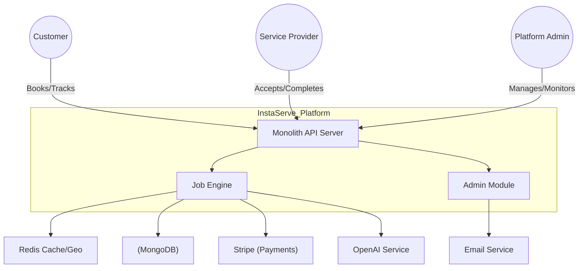
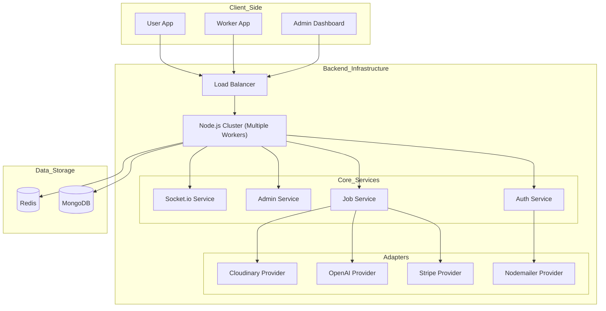
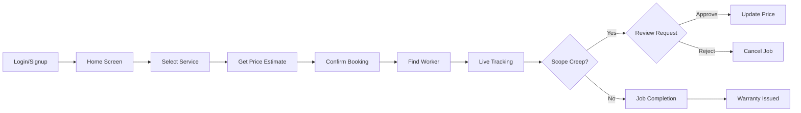
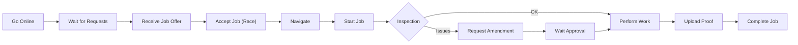

# High-Level Design (HLD)

This document provides a comprehensive high-level overview of the InstaServe platform, focusing on the system context, container architecture, and specific high-level flows.

## 1. System Context Diagram

The system interactions at the highest level, showing how external actors interact with the InstaServe platform.

## 2. Container Architecture

A breakdown of the specific applications, services, and databases.

## 3. User Flow HLD

The high-level journey of a customer.

## 4. Worker Flow HLD

The high-level journey of a service provider.

