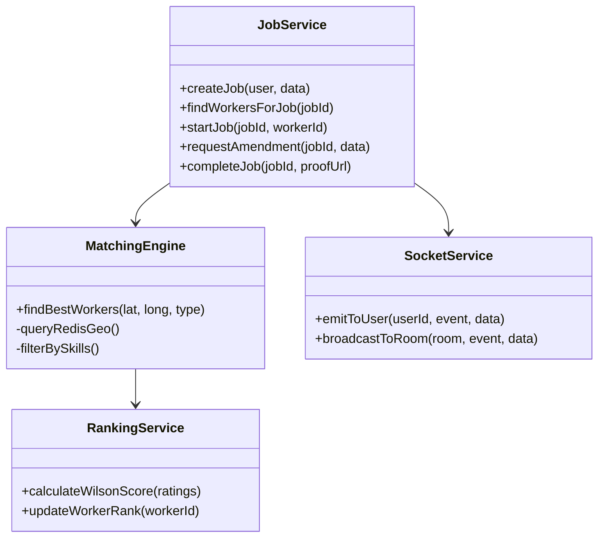
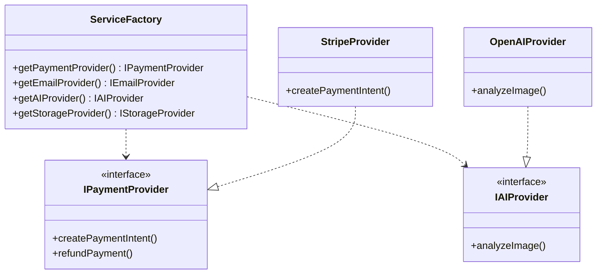

# Low-Level Design (LLD)

This document details the internal logic and component-level architecture for the backend modules.

## 1. Core Service Modules

Detailed view of the core logic classes in the backend.

## 2. External Service Abstraction (Adapter Pattern)

We use a `ServiceFactory` to decouple business logic from specific providers.

## 3. Critical Algorithms

### 3.1 Dynamic Pricing
`Total = Base + (Distance * Rate) + VisitFee`
*   **Distance**: Calculated using Haversine formula (or Redis `GEODIST`).
*   **Surge**: Multiplier applied during high demand.

### 3.2 Wilson Score Ranking
Used to rank workers reliably even with few reviews.
`((p + z²/2n) - z * sqrt((p(1-p) + z²/4n)/n)) / (1 + z²/n)`
*   `p`: Positive rating ratio
*   `n`: Total ratings
*   `z`: 1.96 (95% confidence)

### 3.3 AI Verification
Middleware hook in `completeJob`:
1.  **Input**: `proofUrl` (Image)
2.  **Process**: Send to `AIProvider` with prompt "Is this completed work?".
3.  **Decision**: If confidence < 0.7, throw `AppError` and block completion (force dispute).
