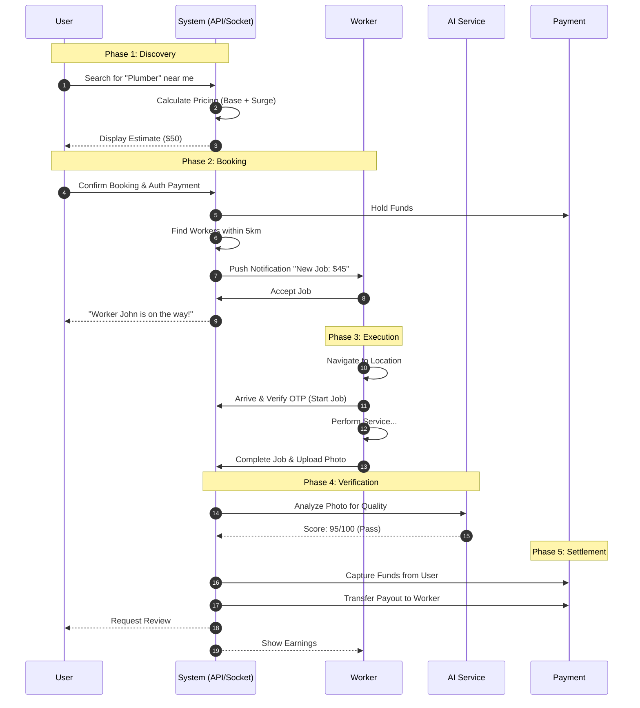
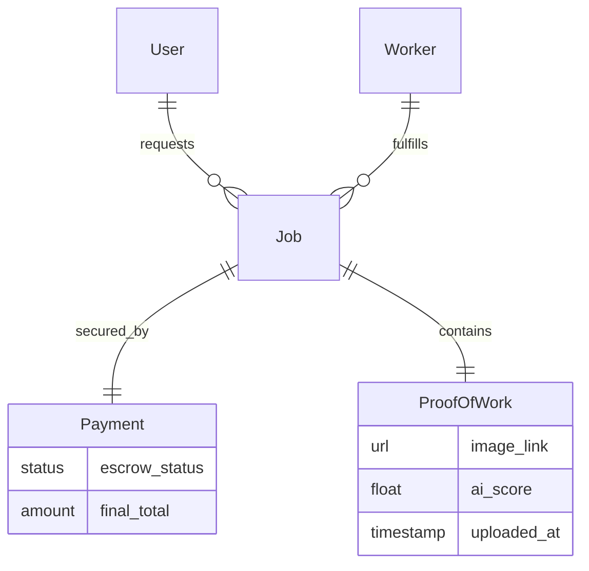

# Combined System Flows

This document unifies the specific architectural views into a single cohesive narrative, illustrating the complete lifecycle of the InstaServe platform.

## 1. The Core Ecosystem
The following High-Level diagram re-iterates how all major components—Mobile Apps, Edge Services, Core Backend, and External APIs—orchestrate together.

```mermaid
graph TD
    subgraph Users
        UserApp[User Application]
        WorkerApp[Worker Application]
    end

    subgraph "Edge & Gateway"
        GLB[Global Load Balancer]
        Edge[Edge Functions (Auth/Rate Limit)]
    end

    subgraph "Core Backend Services"
        API[Monolith API]
        Match[Matchmaking Service]
        Pricing[Pricing Engine]
        Socket[Real-time Socket.io]
        JobMgr[Job Manager]
    end

    subgraph "Data & Storage"
        Postgres[(Primary DB)]
        Redis[(Cache & Pub/Sub)]
        S3[(Image Storage)]
    end

    subgraph "External Providers"
        Maps[Google Maps]
        AI[OpenAI Vision]
        Stripe[Payment Gateway]
    end

    UserApp --> GLB
    WorkerApp --> GLB
    GLB --> Edge
    Edge --> API
    
    API --> Match
    API --> Pricing
    API --> JobMgr
    
    Match --> Maps
    Match --> Redis
    
    JobMgr --> Postgres
    JobMgr --> S3
    JobMgr --> AI
    
    API --> Stripe
    
    Socket <--> Redis
    Socket <--> UserApp
    Socket <--> WorkerApp
```

## 2. The Complete End-to-End Booking Cycle
This sequence diagram shows the "Happy Path" from the moment a user opens the app to the final payment settlement.



## 3. Unified Data Relationship Snapshot
A simplified view of how the core data entities relate to support the flow above.


