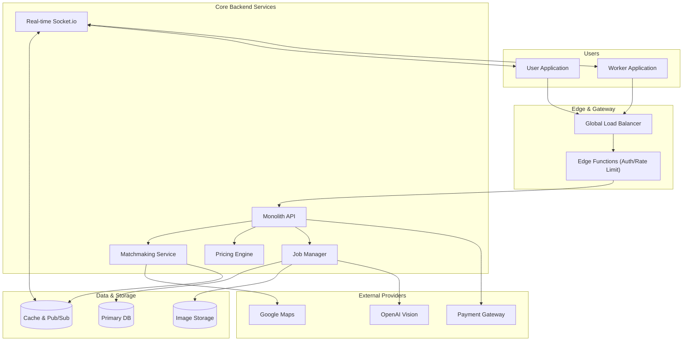
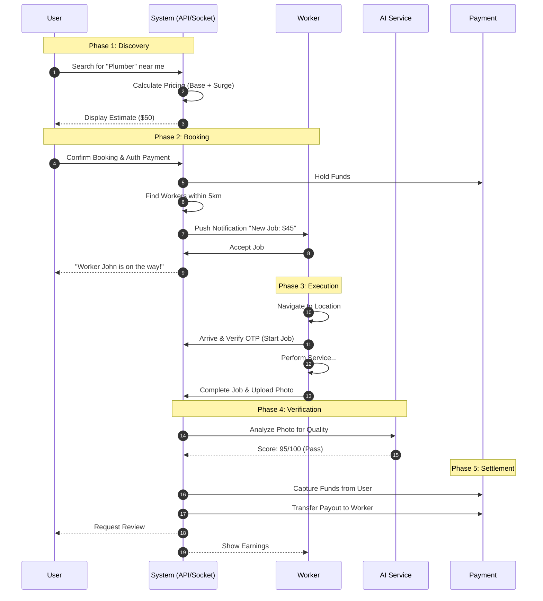
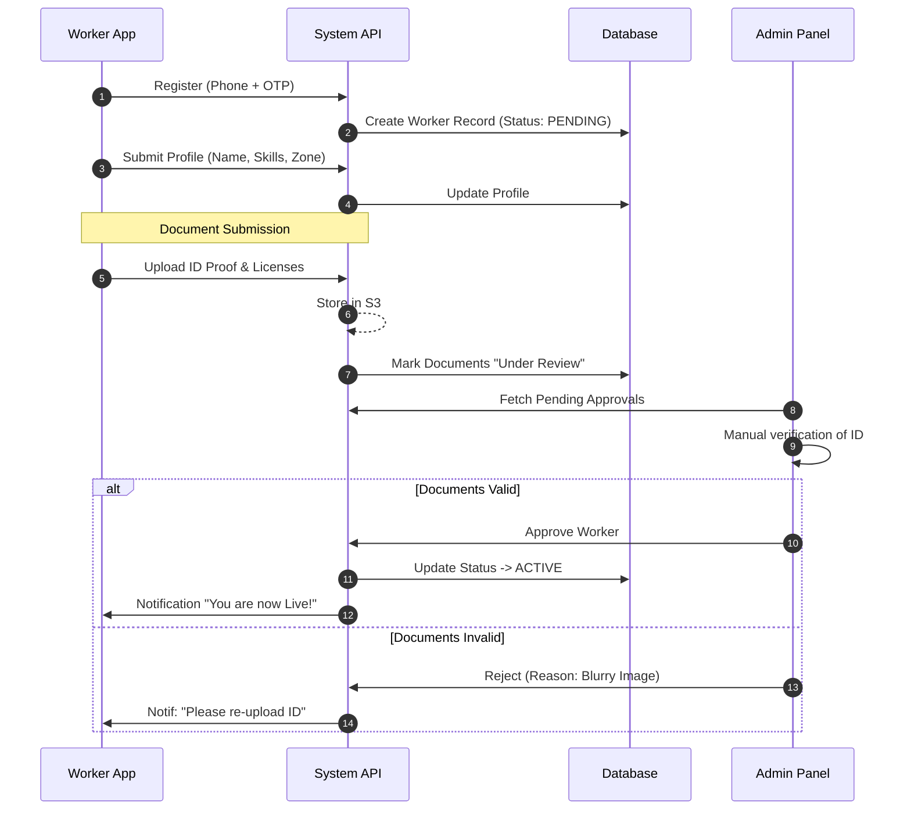
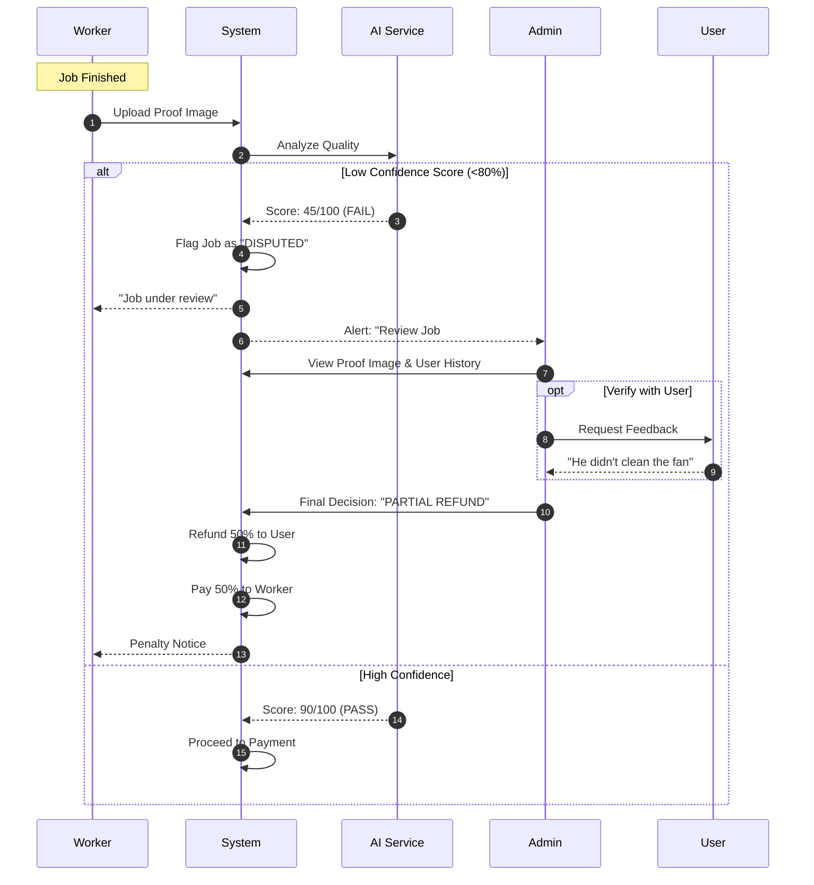
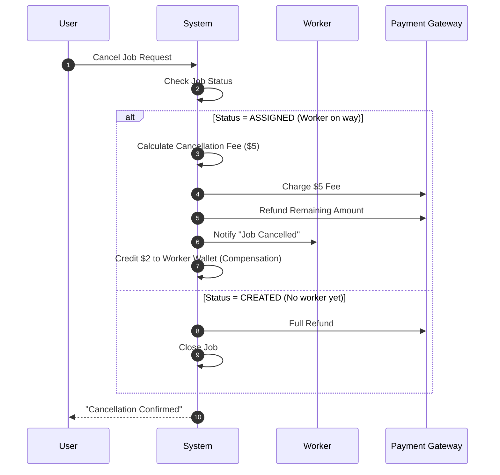
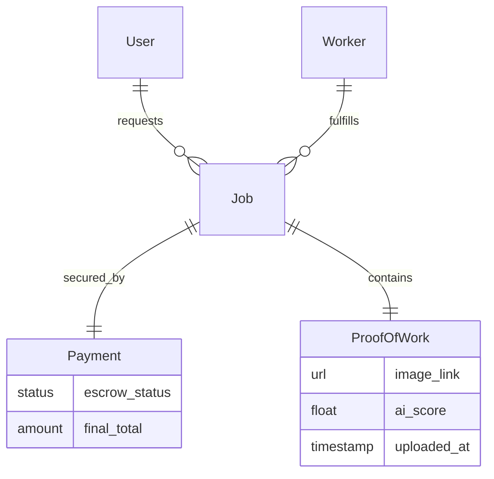

# Combined System Flows

This document unifies the specific architectural views into a single cohesive narrative, illustrating the complete lifecycle of the InstaServe platform.

## 1. The Core Ecosystem
The following High-Level diagram re-iterates how all major components—Mobile Apps, Edge Services, Core Backend, and External APIs—orchestrate together.

## 2. The Complete End-to-End Booking Cycle
This sequence diagram shows the "Happy Path" from the moment a user opens the app to the final payment settlement.

## 3. Worker Onboarding & KYC Flow
The journey of a new worker joining the platform, from registration to becoming eligible for jobs.

## 4. Dispute Resolution Flow
Complex flow involving AI flagging and manual admin intervention when things go wrong.

## 5. Job Cancellation & Refund Flow
Handling cancellations after booking but before job completion.

## 6. Unified Data Relationship Snapshot
A simplified view of how the core data entities relate to support the flows above.

