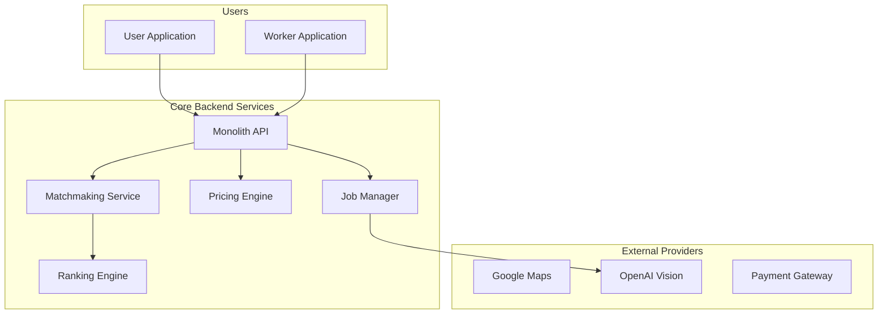
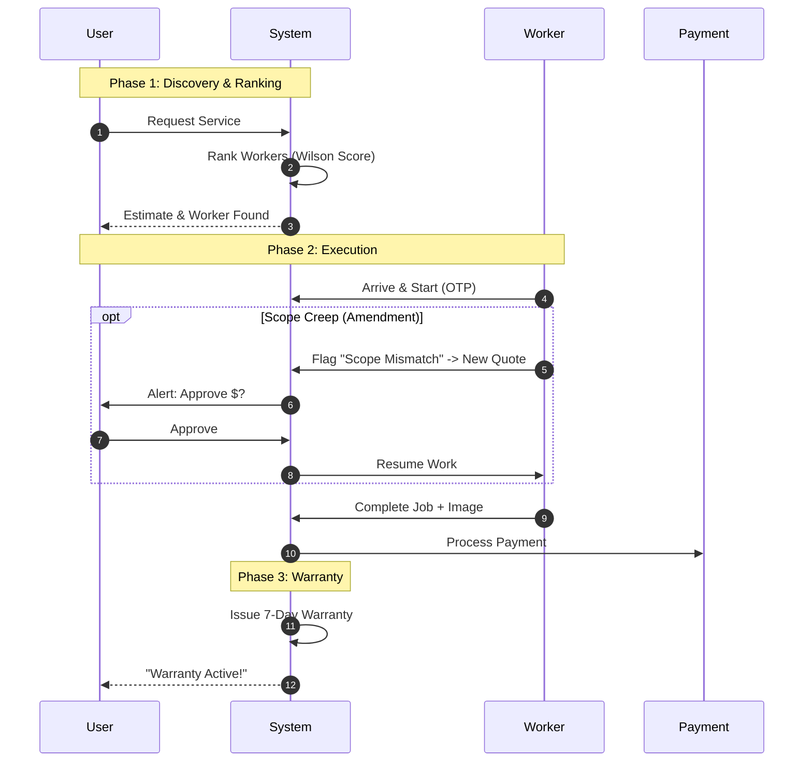
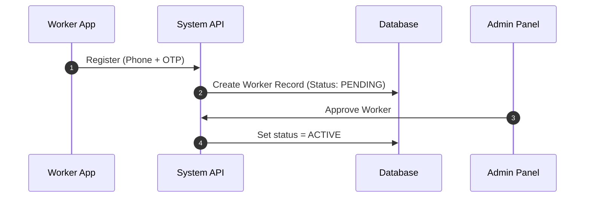
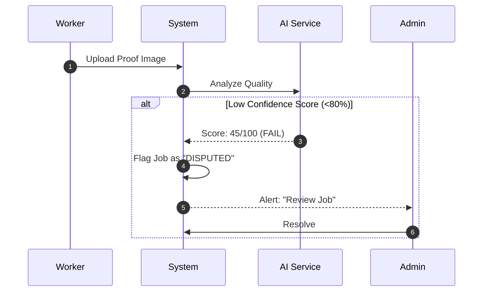
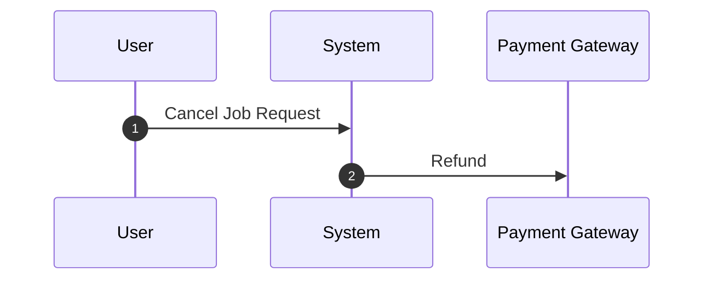

# Combined System Flows

This document unifies the specific architectural views into a single cohesive narrative, illustrating the complete lifecycle of the InstaServe platform, including advanced modules.

## 1. The Core Ecosystem
The following High-Level diagram re-iterates how all major components—Mobile Apps, Edge Services, Core Backend, and External APIs—orchestrate together.

## 2. The Complete End-to-End Booking Cycle (with Scope Creep)
This sequence diagram shows the full path, including the potential for "Scope Creep" amendments.

## 3. Worker Onboarding & KYC Flow
The journey of a new worker joining the platform.

## 4. Dispute Resolution Flow
Complex flow involving AI flagging and manual admin intervention.

## 5. Job Cancellation & Refund Flow
Handling cancellations after booking.

