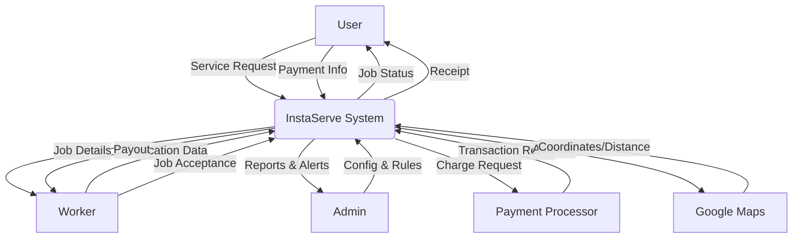
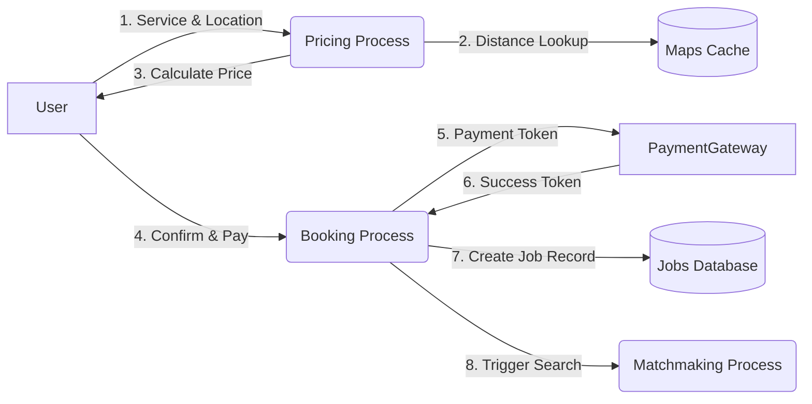
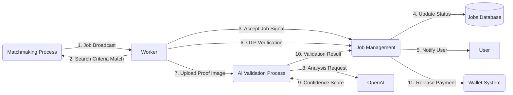
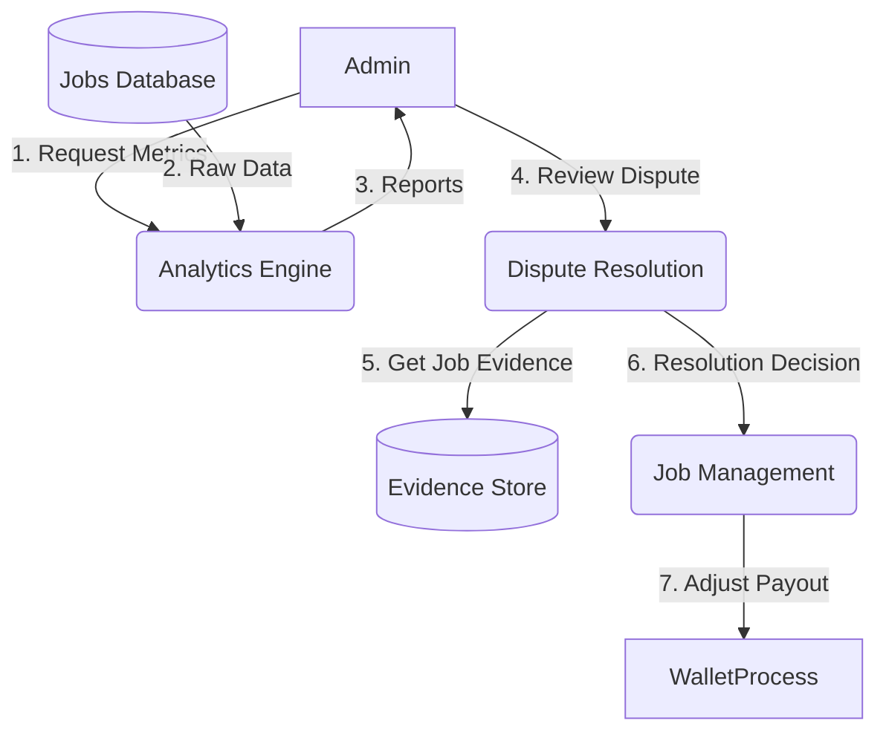

# Data Flow Diagrams (DFD)

This document illustrates how data moves through the InstaServe system, from external entities to processes and data stores.

## 1. Level 0 DFD (Context Diagram)

The broad view of data inputs and outputs between the system and external entities.

## 2. User Booking Flow (Level 1)

Detailed data movement for the booking process.

## 3. Worker Fulfillment Flow (Level 1)

Detailed data movement for job acceptance and completion.

## 4. Admin Management Flow (Level 1)

Detailed data movement for administrative tasks.

