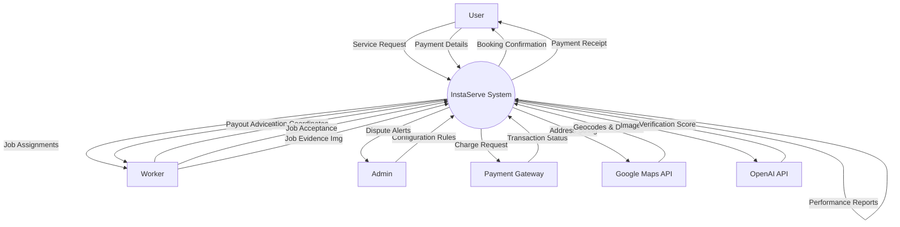
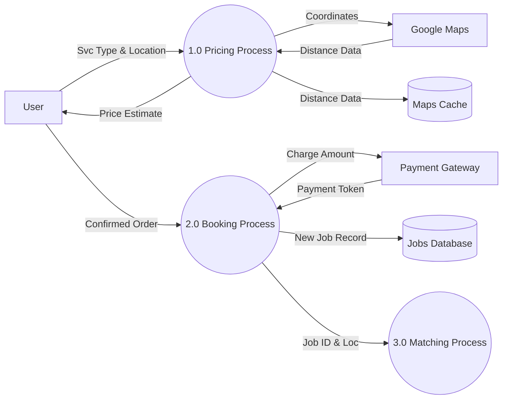
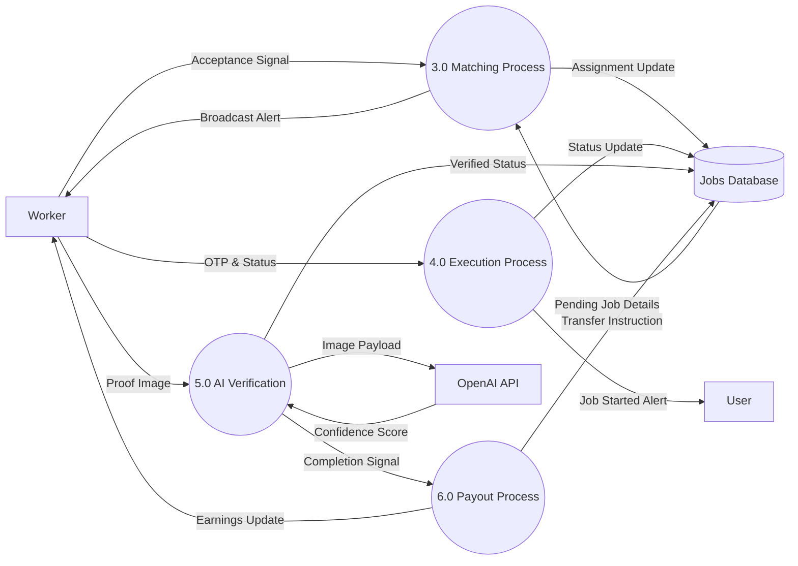

# Data Flow Diagrams (DFD)

This document illustrates how data moves through the InstaServe system, using standard Data Flow Diagram notation.

*   **Square (`[...]`)**: External Entity (Source/Sink)
*   **Rounded (`(...)`)**: Process (Transformer of data)
*   **Cylinder (`[(...)]`)**: Data Store (Storage)
*   **Arrow**: Data Flow

## 1. Level 0 DFD (Context Diagram)

The system as a single black box, showing interactions with external entities.

## 2. Level 1 DFD: Booking & Pricing

Process decomposition of the booking phase.

## 3. Level 1 DFD: Fulfillment & Verification

Process decomposition of the job execution phase.

