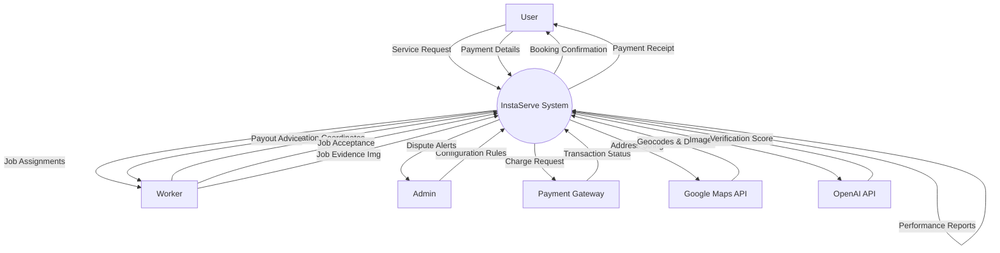
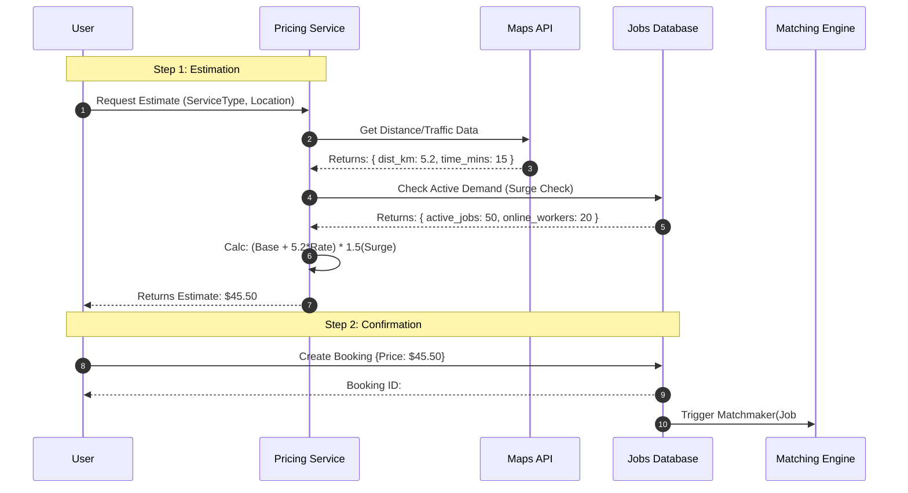
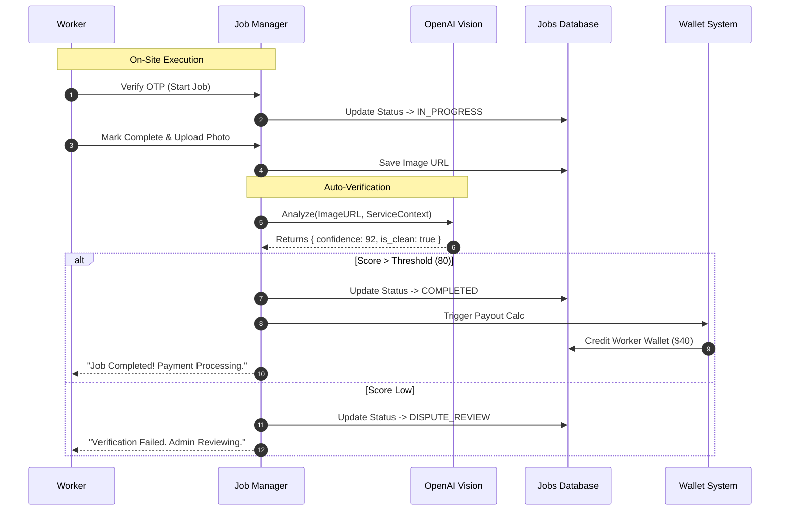
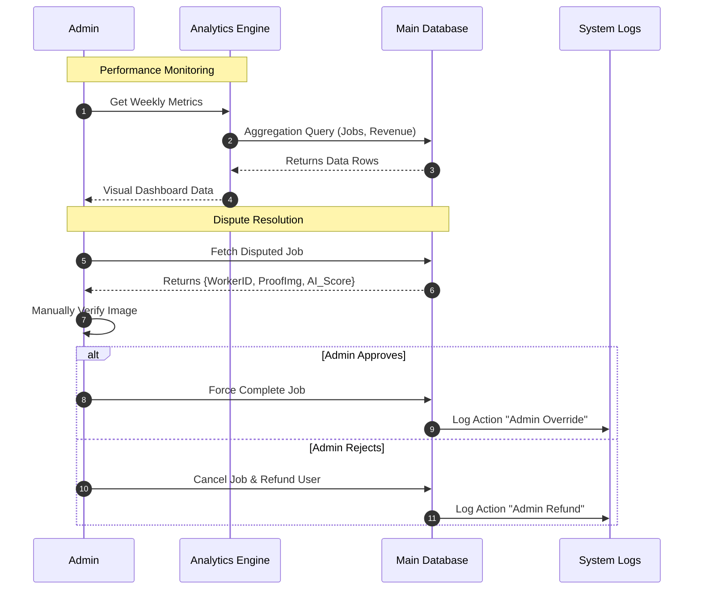

# Data Flow & Interaction Diagrams

This document details the flow of data and control through the InstaServe system.
Per user request, these are modeled as **Sequence Diagrams** to clearly show the temporal interactions and data exchange between components.

## 1. System Context (Component Interaction)

The high-level exchange of data between the System and External Entities.

## 2. Booking & Pricing Flow (Detailed Sequence)

Data flow for calculating price, generating estimates, and confirming a booking.

## 3. Fulfillment & Verification Flow (Detailed Sequence)

Data flow for job execution, proof submission, and AI verification.

## 4. Admin & Reporting Flow (Detailed Sequence)

Data flow for administrative monitoring and dispute handling.

