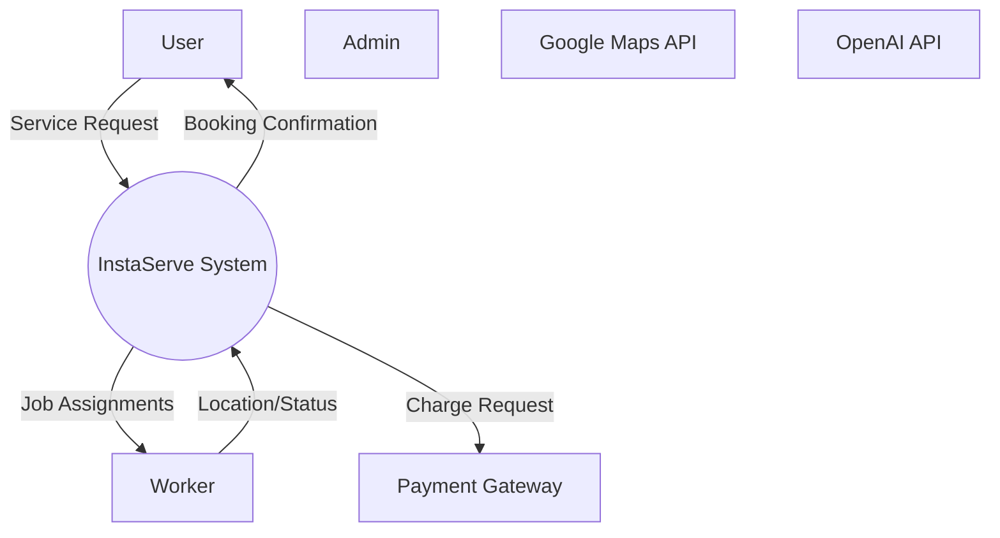
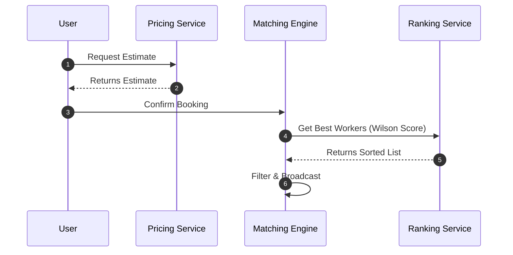
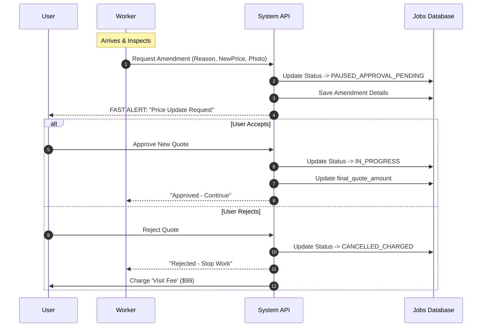
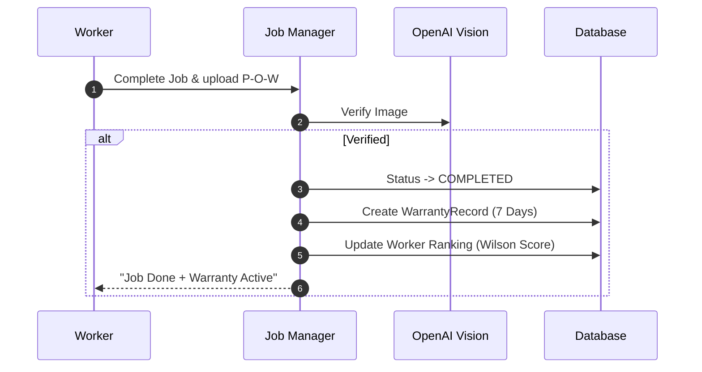

# Data Flow & Interaction Diagrams

This document details the flow of data and control through the InstaServe system.

## 1. System Context (Component Interaction)

The high-level exchange of data between the System and External Entities.

## 2. Booking & Pricing Flow (Detailed Sequence)

Data flow for calculating price, generating estimates, and confirming a booking.

## 3. Scope Creep & Amendment Flow (New)

Data flow for handling price hikes during a job execution.

## 4. Fulfillment & Warranty Flow

Data flow for job completion and automatic warranty issuance.

