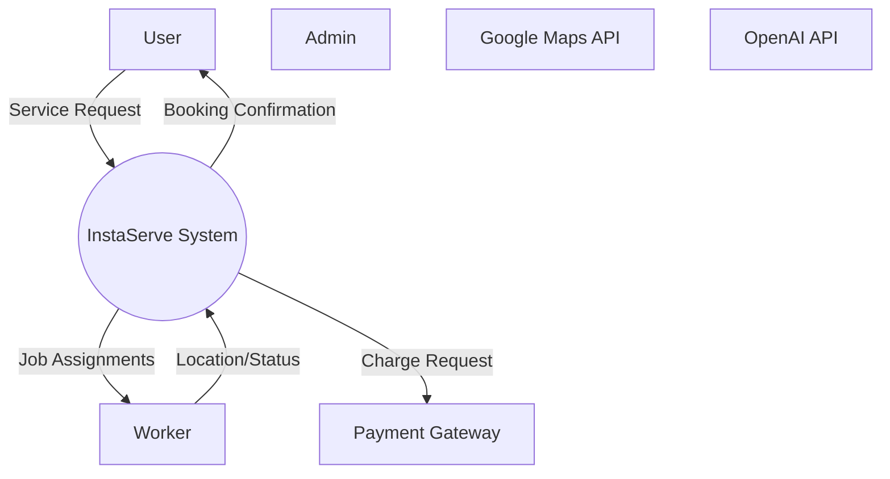
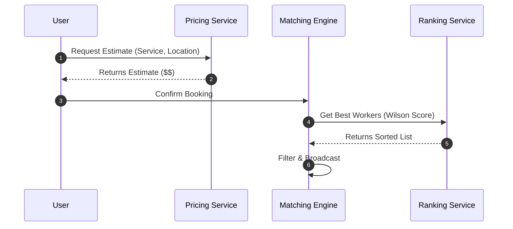
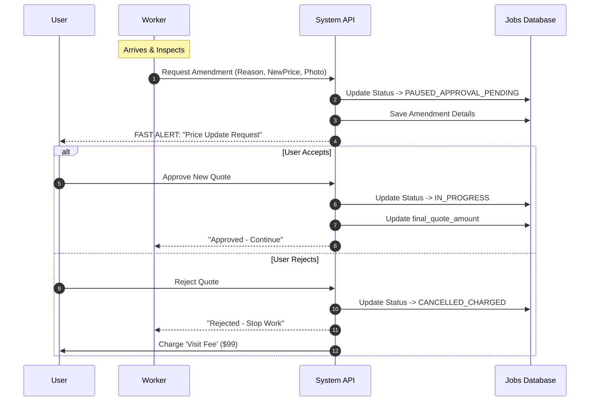
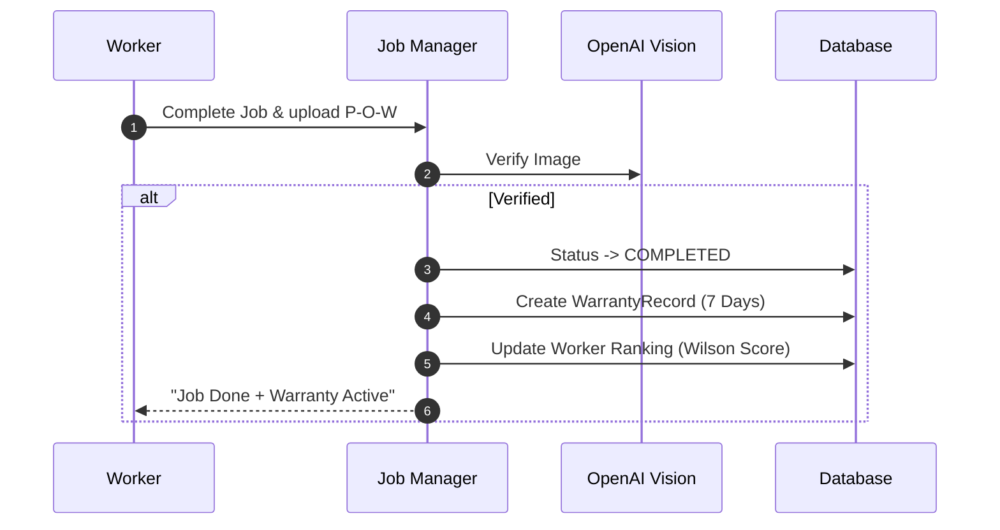

# Data Flow & Interaction Diagrams

This document details the flow of data and control through the InstaServe system. It focuses on the time-ordered sequence of events between system components.

## 1. System Context (Component Interaction)

The high-level exchange of data between the System and External Entities.

### Interaction Overview
This diagram illustrates the boundaries of the system.
*   **Inbound Data**: The System receives Service Requests (User), Location Updates (Worker), and Management Commands (Admin).
*   **Outbound Data**: The System pushes Booking Confirmations (User), Job Assignments (Worker), and Financial Requests (Bank).

---

## 2. Booking & Pricing Flow (Detailed Sequence)

Data flow for calculating price, generating estimates, and confirming a booking.

### Step-by-Step Breakdown
1.  **Estimation**: The User selects a service. The `PricingEngine` calculates a dynamic price based on base rates, distance, and current demand (surge).
2.  **Confirmation**: User clicks "Book Now". This triggers the `Matching Engine`.
3.  **Optimization**: Instead of broadcasting to *any* nearby worker, the `Ranking Service` sorts them by reliability (Wilson Score).
4.  **Broadcast**: The job is offered to the top-ranked candidates first.

### Key Data Objects
*   `EstimateRequest`: `{ service_id: "cleaning-v1", lat: 28.704, long: 77.102, tier: "premium" }`
*   `WorkerRankTuple`: `[ { worker_id: "w123", distance: 1.2km, score: 0.95 }, ... ]`

---

## 3. Scope Creep & Amendment Flow (New)

Data flow for handling price hikes (amendments) during a job execution. This is a critical feature for "fairness" in the marketplace.

### Functional Description
Often, the scope of work is larger than what the user booked (e.g., "Deep Clean" turned out to be "Industrial Clean").
*   **Pause State**: The job is effectively paused (`PAUSED_APPROVAL_PENDING`) while waiting for the user.
*   **Proof**: The worker MUST upload a photo (e.g., of the extra mess) to justify the hike.
*   **User Agency**: The user has the final say. If they reject, they pay a "Visit Fee" for the worker's time, but not the full job price.

---

## 4. Fulfillment & Warranty Flow

Data flow for job completion and automatic warranty issuance.

### Sequence Details
1.  **Proof of Work (P-O-W)**: Worker signals completion. Uses camera to capture the result.
2.  **AI Audit**: `OpenAI` (Vision Model) checks if the image matches the service type (e.g., "Is this a clean room?").
3.  **Closure**:
    *   **Financial**: Funds released to Worker wallet.
    *   **Trust**: User gets a 7-day warranty logged in the system.
    *   **Reputation**: Worker's Wilson Score is updated based on the successful completion.
