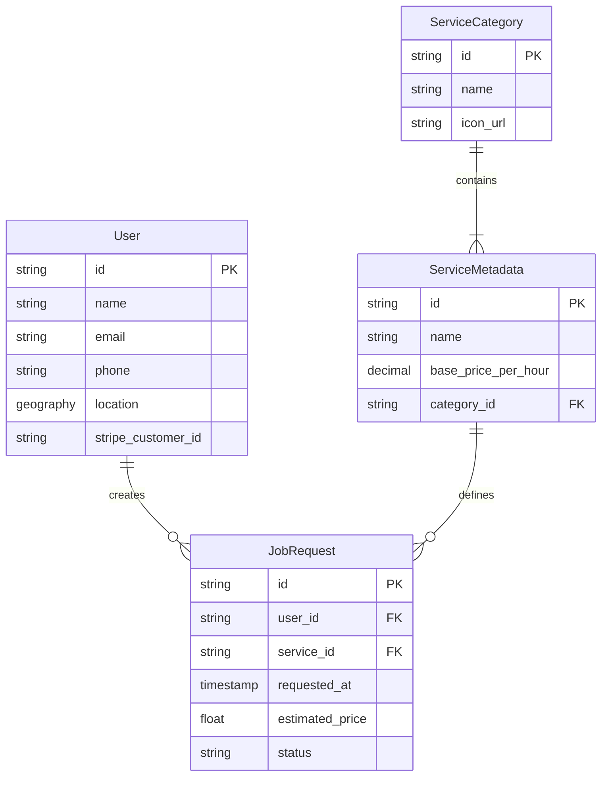
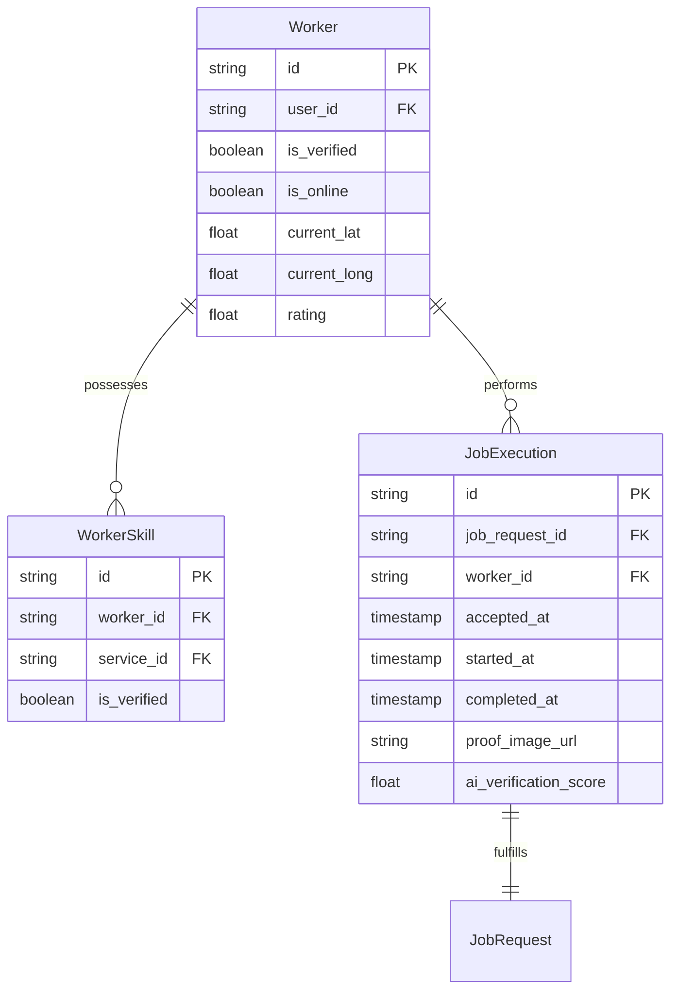
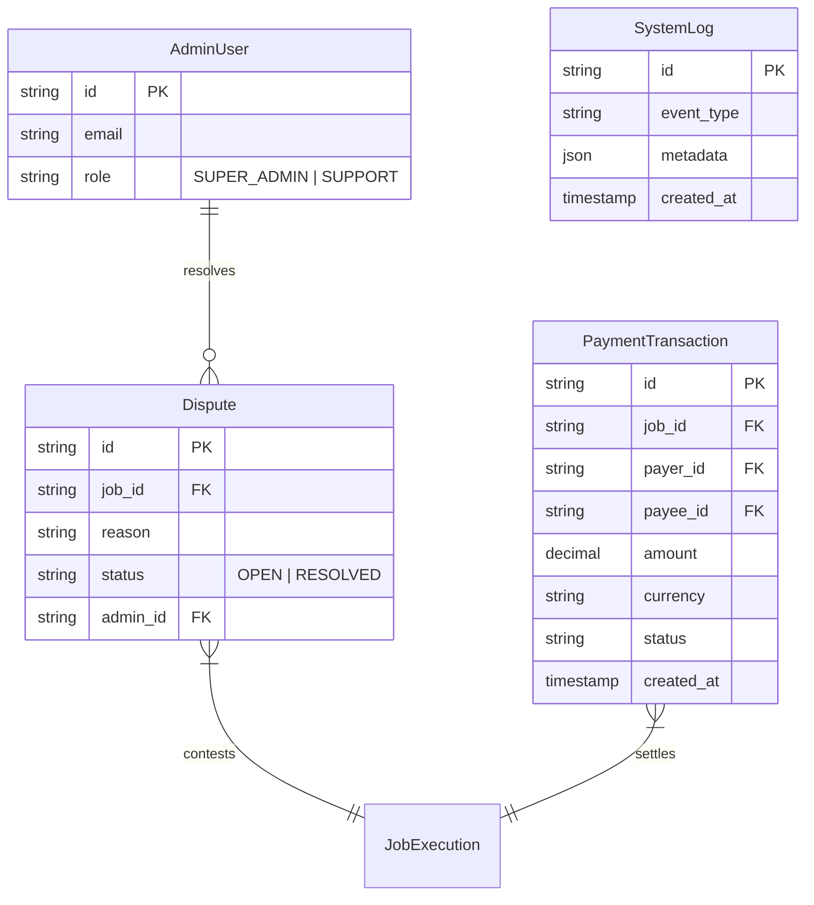
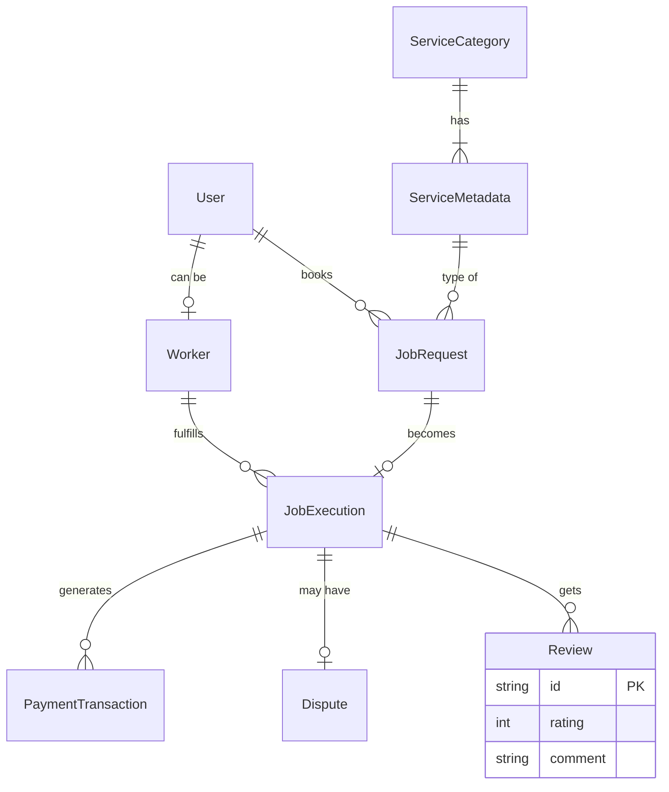

# Entity Relationship Diagrams (ERD)

This document breaks down the data models for different domains of the system, followed by a unified schema.

## 1. User & Service Domain ERD

Focuses on how users interact with services and specific job requests.

## 2. Worker & Fulfillment Domain ERD

Focuses on worker profiles, skills, and actual job execution.

## 3. Admin & Operations ERD

Focuses on disputes, payments, and system logs.

## 4. Unified System Schema

The complete overview of all major entities and their relationships.

