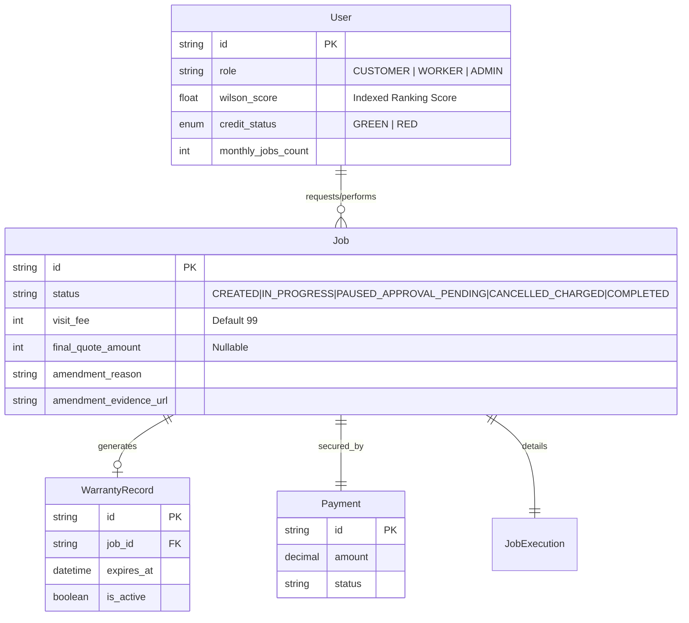
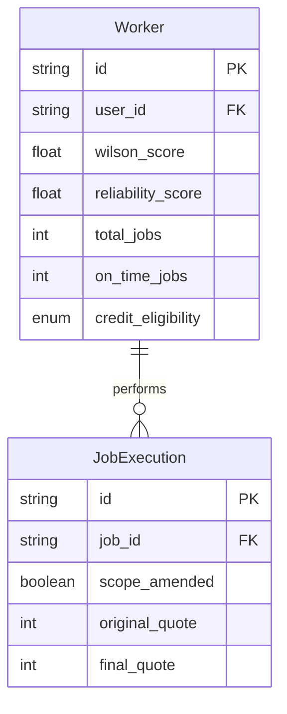

# Entity Relationship Diagrams (ERD)

This document breaks down the data models for different domains of the system, followed by a unified schema.

## 1. Unified System Schema (Updated)

The complete overview including Warranty, Ranking, and Scope Creep extensions.

## 2. Worker & Fulfillment Domain (Detailed)

Focuses on worker profiles, skills, and ranking.

