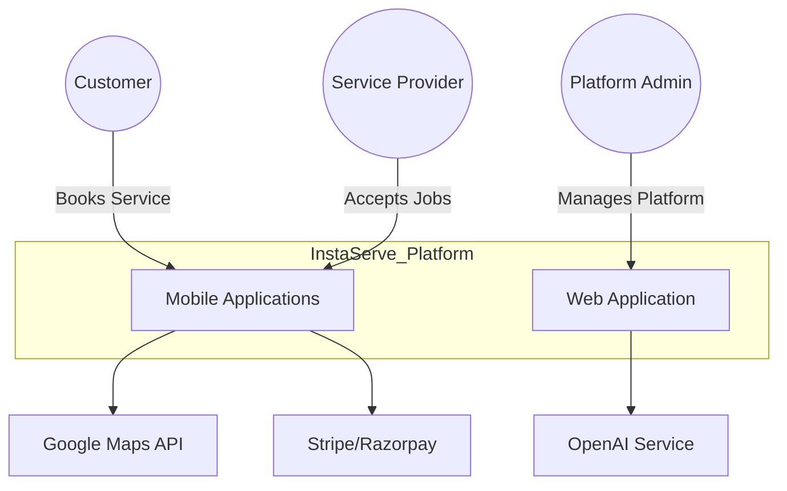
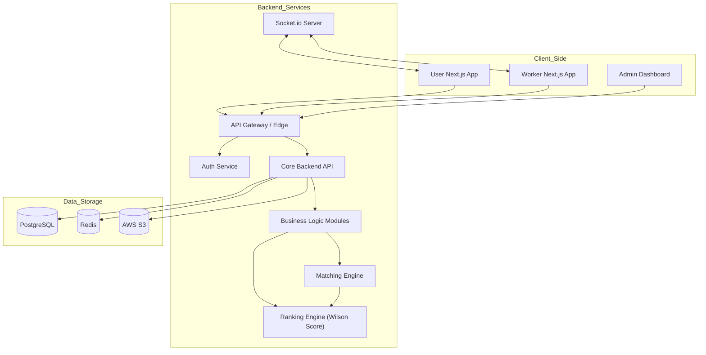
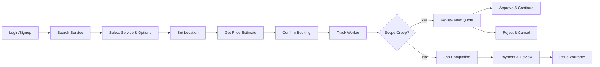
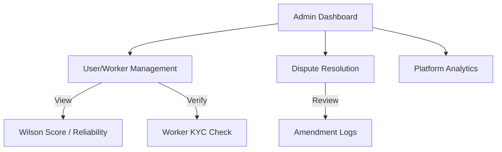

# High-Level Design (HLD)

This document provides a comprehensive high-level overview of the InstaServe platform, focusing on the system context, container architecture, and specific high-level flows for User, Worker, and Admin roles.

## 1. System Context Diagram

The system interactions at the highest level, showing how external actors interact with the InstaServe platform.

### Component Roles & External Systems
*   **User (Customer)**: The end-user seeking services (cleaning, repair, etc.). Interactions are primarily through the Mobile/Web App to book, track, and pay.
*   **Worker (Service Provider)**: The professional fulfilling the request. Uses a dedicated interface to receive jobs, navigate, and manage work orders.
*   **Admin (Platform Admin)**: Oversees operations, manages disputes, broadcasts updates, and monitors platform health via the Web Interface.
*   **Maps API**: Critical for location-based matching, real-time tracking of workers, and address validation.
*   **Payment Gateway**: Handles secure transactions, holding funds in escrow until job completion is verified.
*   **OpenAI Service**: accurate categorization of job requests and potentially for automated visual verification of completed work (e.g., analyzing "after" photos).

---

## 2. Container Architecture

A breakdown of the specific applications, services, and databases that make up the InstaServe system.

### Component Breakdown

#### A. Client-Side Applications
*   **User App (Next.js)**: A responsive PWA/Web app focused on conversion. Features include service selection, slot booking, and live tracking.
*   **Worker App (Next.js)**: Optimized for mobile usage. Key features: "Go Online" toggle, job acceptance cards, navigation integration, and proof-of-work upload.
*   **Admin Panel (React/Next.js)**: A data-dense dashboard for operations teams to view heatmaps, resolve disputes, and manage liquidity (worker supply).

#### B. Backend Services
*   **API Gateway**: The single entry point for all client requests, handling rate limiting, routing, and initial security checks.
*   **Auth Service**: Manages JWT issuance, refresh tokens, and OAuth integrations.
*   **Core Backend API (Node.js/Express)**: Orchestrates business processes. It connects REST endpoints to logic modules.
*   **Matching Engine**: The "brain" of logistics. It finds the nearest, highest-ranked available worker for a specific job type.
*   **Ranking Engine**: Implements the **Wilson Score Interval** to calculate a statistically significant score for workers based on positive vs. negative ratings, ensuring reliability over simple averages.
*   **Socket.io Server**: Maintains persistent connections for real-time events like "Job Accepted", "Worker Arrived", and Chat messages.

#### C. Data Storage
*   **PostgreSQL**: Primary source of truth. Stores Users, Orders, Transactions, and relational data.
*   **Redis**: High-speed caching layer. Used for:
    *   **Geospatial Indexing**: Storing worker locations (`GEOADD`) for searching nearest neighbors (`GEORADIUS`).
    *   **Session Management**: Storing active auth tokens.
*   **AWS S3**: Object storage for user avatars, job evidence photos (Before/After), and legal documents.

---

## 3. User Flow HLD

The high-level journey of a customer using the platform.

### Functional Description
The User Flow is designed to be linear and friction-free, minimizing the steps to conversion ("Booking").

1.  **Discovery & Pricing**: The user enters their needs. The system uses the 'Pricing Engine' to generate an upfront estimate.
2.  **Booking**: User confirms the slot. The system reserves the amount (Authorization hold) but doesn't charge yet.
3.  **Service Delivery**: The user tracks the worker's approach on a map.
4.  **Completion**: Once the job is done, the payment is captured, and a warranty is generated.

### Key Scenarios
*   **Scenario: Scope Creep (Amendment)**
    *   **Trigger**: Worker arrives and finds the job is larger than described (e.g., "Deep Clean" needed instead of "Basic").
    *   **Action**: Worker sends a "Revised Quote".
    *   **User Interaction**: A modal pops up on the User's screen: "Worker requests amendment: +$20 for Extra Room. Approve?".
    *   **Outcome**: If Approved, the total authorized amount is updated. If Rejected, the job may be cancelled or proceed with original scope only.

---

## 4. Worker Flow HLD

The high-level journey of a service provider (Worker/Captain).

```mermaid
graph LR
    Online[Go Online] --> Wait[Wait for Requests]
    Wait --> Receive["Receive Job (Ranked)"]
    Receive --> Accept[Accept Job]
    Accept --> Navigate[Navigate to Location]
    Navigate --> Start["Start Job (OTP)"]
    
    Start --> Inspect[Inspect Scope]
    Inspect -- Extra Work --> Amend[Request Amendment]
    Amend --> WaitApprove[Wait Approval]
    WaitApprove --> Resume[Resume Job]
    
    Inspect -- Normal Scope --> Resume
    
    Resume --> Verify[Upload Verification Photo]
    Verify --> Finish[Complete Job]
    Finish --> Earn[Receive Payment + Score]
```

### Functional Description
The Worker Flow emphasizes clarity and speed. Workers effectively "compete" for jobs based on their customized ranking.

1.  **Availability**: Worker toggles "Online". Their location is effectively "pinged" to Redis every few seconds.
2.  **Job Allocation**: When a job matches, they receive a "Job Card" with distance and earnings. They have ~30s to accept.
3.  **Execution**: Includes navigation and "Start Job" validation (often via OTP provided by the user) to ensure physical presence.
4.  **Verification**: Worker MUST upload proof (photo/video) before marking the job as complete.

### Key Scenarios
*   **Scenario: Job Broadcasting**:
    *   The system doesn't blast all workers. It selects the Top 3 nearest & highest-ranked workers.
    *   If Worker A rejects, it cascades to Worker B.
*   **Scenario: Safety & Evidence**:
    *   "Start Job" requires user consent (OTP).
    *   "End Job" requires visual evidence. This protects the worker from "Indexemption" claims (User claiming work not done) and protects the User from poor quality.

---

## 5. Admin Flow HLD

The high-level administrative functions managed by platform owners.

### Functional Description
The Admin Panel is the control tower. It is not just for viewing data but for active management.

*   **Dispute Resolution**: Admins can view the "Before" vs. "After" photos and the Chat logs to arbitrate refunds or payments.
*   **Quality Control**: Monitoring the "Wilson Score" of workers. Low-score workers are automatically flagged for retraining or offboarding.
*   **Financial Health**: Tracking "Burn Rate", "Gross Merchandise Value (GMV)", and "Unit Economics" per service category.
