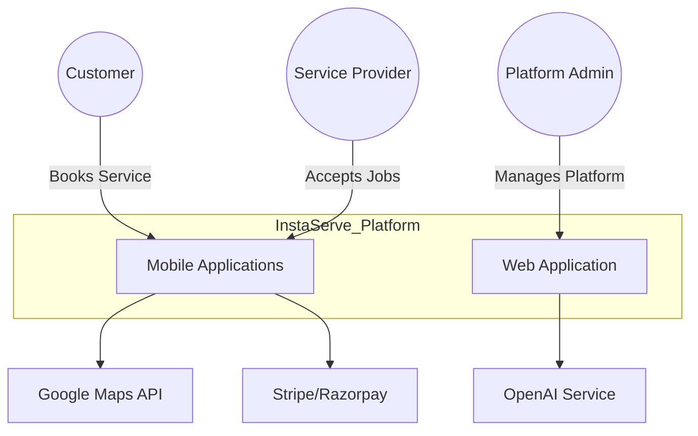
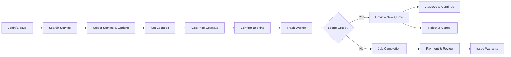
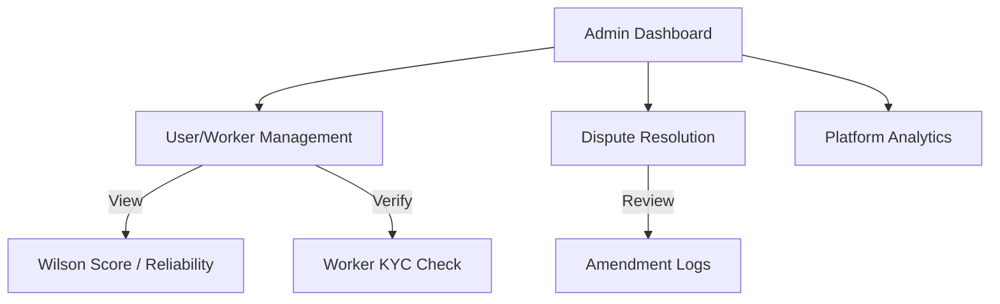

# High-Level Design (HLD)

This document provides a comprehensive high-level overview of the InstaServe platform, focusing on the system context, container architecture, and specific high-level flows for User, Worker, and Admin roles.

## 1. System Context Diagram

The system interactions at the highest level, showing how external actors interact with the InstaServe platform.



## 2. Container Architecture

A breakdown of the specific applications, services, and databases that make up the InstaServe system.

```mermaid
graph TB
    subgraph Client_Side
        UserApp[User Next.js App]
        WorkerApp[Worker Next.js App]
        AdminPanel[Admin Dashboard]
    end

    subgraph Backend_Services
        APIGateway[API Gateway / Edge]
        AuthService[Auth Service]
        CoreAPI[Core Backend API]
        SocketServer[Socket.io Server]
        
        Matcher[Matching Engine]
        Ranking[Ranking Engine (Wilson Score)]
        Logic[Business Logic Modules]
    end

    subgraph Data_Storage
        MainDB[(PostgreSQL)]
        Cache[(Redis)]
        ObjectStore[(AWS S3)]
    end

    UserApp --> APIGateway
    WorkerApp --> APIGateway
    AdminPanel --> APIGateway

    APIGateway --> AuthService
    APIGateway --> CoreAPI
    
    CoreAPI --> MainDB
    CoreAPI --> Cache
    CoreAPI --> ObjectStore
    
    CoreAPI --> Logic
    Logic --> Matcher
    Logic --> Ranking
    Matcher --> Ranking
    
    SocketServer <--> UserApp
    SocketServer <--> WorkerApp
```

## 3. User Flow HLD

The high-level journey of a customer using the platform.



## 4. Worker Flow HLD

The high-level journey of a service provider (Worker/Captain).

```mermaid
graph LR
    Online[Go Online] --> Wait[Wait for Requests]
    Wait --> Receive[Receive Job (Ranked)]
    Receive --> Accept[Accept Job]
    Accept --> Navigate[Navigate to Location]
    Navigate --> Start["Start Job (OTP)"]
    
    Start --> Inspect[Inspect Scope]
    Inspect -- Extra Work --> Amend[Request Amendment]
    Amend --> WaitApprove[Wait Approval]
    WaitApprove --> Resume[Resume Job]
    
    Inspect -- Normal Scope --> Resume
    
    Resume --> Verify[Upload Verification Photo]
    Verify --> Finish[Complete Job]
    Finish --> Earn[Receive Payment + Score]
```

## 5. Admin Flow HLD

The high-level administrative functions managed by platform owners.


