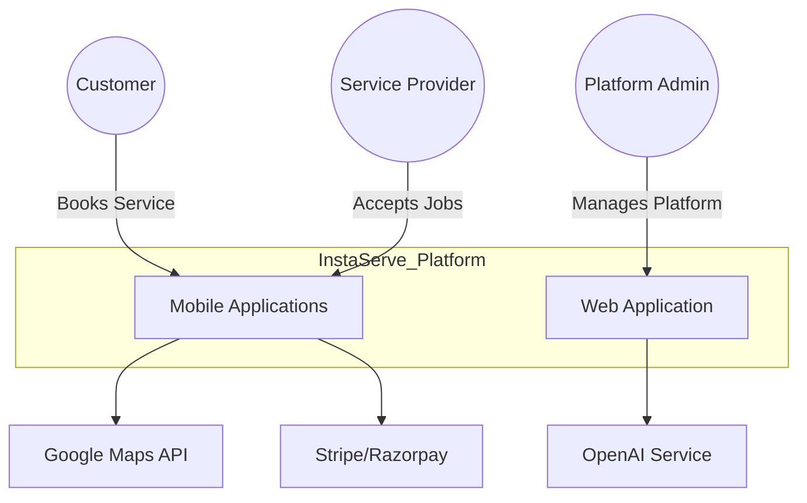
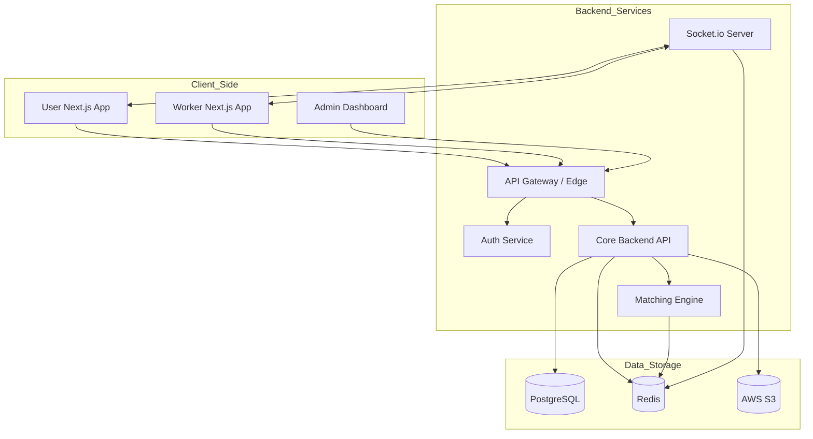
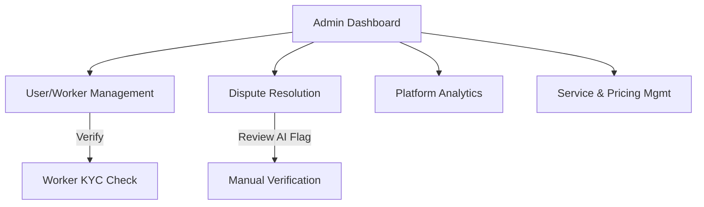

# High-Level Design (HLD)

This document provides a comprehensive high-level overview of the InstaServe platform, focusing on the system context, container architecture, and specific high-level flows for User, Worker, and Admin roles.

## 1. System Context Diagram

The system interactions at the highest level, showing how external actors interact with the InstaServe platform.



## 2. Container Architecture

A breakdown of the specific applications, services, and databases that make up the InstaServe system.



## 3. User Flow HLD

The high-level journey of a customer using the platform.

```mermaid
graph LR
    Login[Login/Signup] --> Search[Search Service]
    Search --> Select[Select Service & Options]
    Select --> Location[Set Location]
    Location --> Estimate[Get Price Estimate]
    Estimate --> Book[Confirm Booking]
    Book --> track[Track Worker]
    track --> Complete[Job Completion]
    Complete --> Pay[Payment & Review]
```



## 4. Worker Flow HLD

The high-level journey of a service provider (Worker/Captain).

```mermaid
graph LR
    Online[Go Online] --> Wait[Wait for Requests]
    Wait --> Receive[Receive Job Broadcast]
    Receive --> Accept[Accept Job]
    Accept --> Navigate[Navigate to Location]
    Navigate --> Start[Start Job (OTP)]
    Start --> Verify[Upload Verification Photo]
    Verify --> Finish[Complete Job]
    Finish --> Earn[Receive Payment]
```

## 5. Admin Flow HLD

The high-level administrative functions managed by platform owners.


