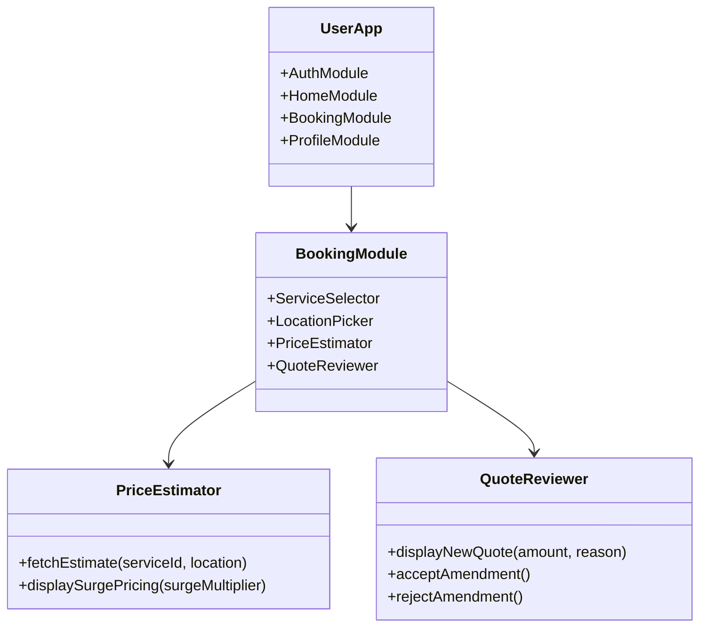
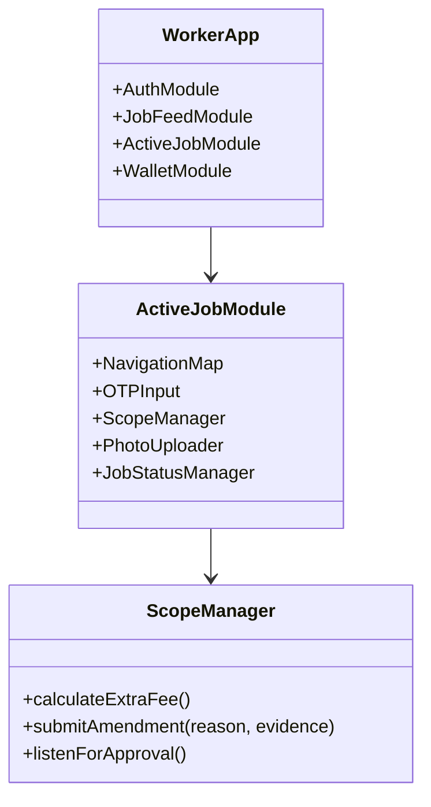
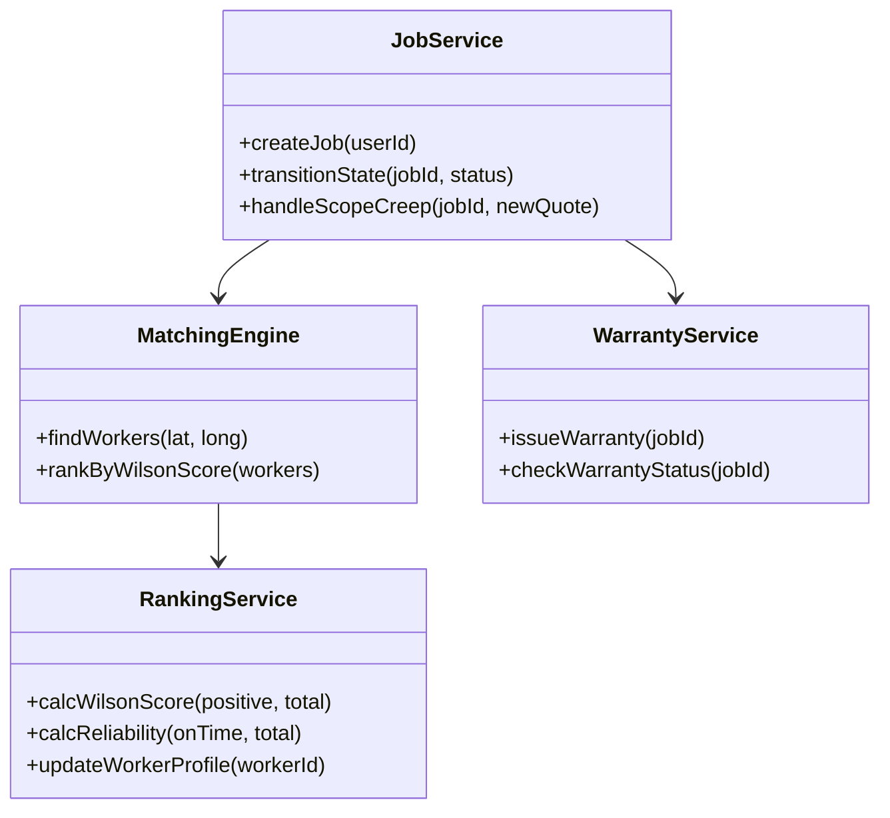

# Low-Level Design (LLD)

This document details the internal logic and component-level architecture for the User, Worker, and Admin applications, as well as the core backend modules.

## 1. User App Components

Key components responsible for the customer experience.

## 2. Worker App Components

Key components enabling service providers to reliably perform jobs.

## 3. Backend Service Modules

Detailed view of the core logic classes in the backend.

## 4. Core Algorithms & Logic

### 4.1 Dynamic Pricing Algorithm
**Formula:** `Total Price = Base Price + (Distance * Rate/km) + Surge Multiplier`

### 4.2 AI Verification Hook
**Workflow:**
1.  **Upload:** Worker uploads image of finished job.
2.  **Analysis:** OpenAI analyzes image against service checklist.
3.  **Result:** High confidence = Auto-complete. Low confidence = Dispute.

### 4.3 Advanced Ranking (Wilson Score)
We replace simple averages with a statistical confidence interval to rank workers.
**Formula (Lower Bound):** 
`((p + z²/2n) - z * sqrt((p(1-p) + z²/4n)/n)) / (1 + z²/n)`
Where `p` is positive rate, `n` is total reviews, `z` is confidence level constant (1.96).

### 4.4 Warranty Trigger
**Logic:**
When Job enters `COMPLETED` state:
1.  System generates `WarrantyRecord` (7-day validity).
2.  Updates User `credit_status`.
3.  Sends "Warranty Active" notification to Customer.
