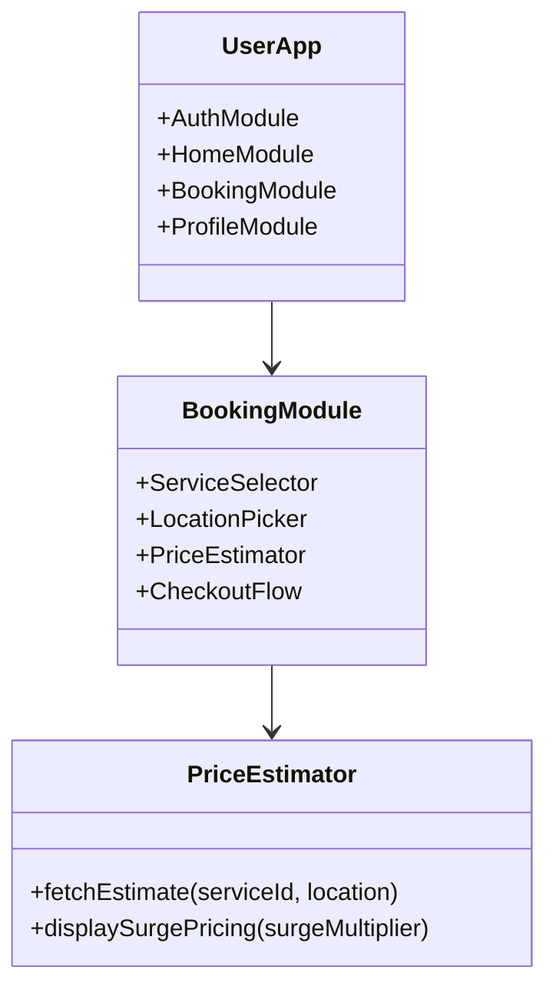
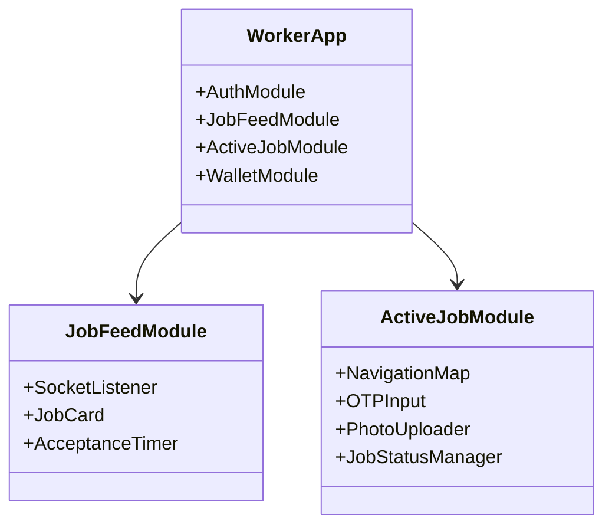
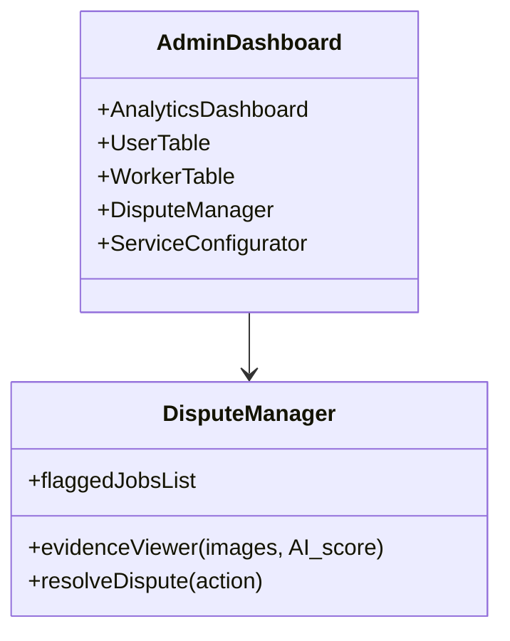
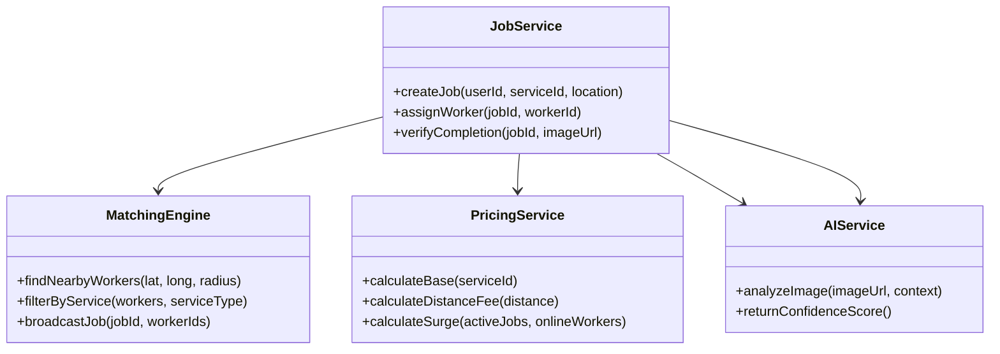

# Low-Level Design (LLD)

This document details the internal logic and component-level architecture for the User, Worker, and Admin applications, as well as the core backend modules.

## 1. User App Components

Key components responsible for the customer experience.



## 2. Worker App Components

Key components enabling service providers to reliable perform jobs.



## 3. Admin Dashboard Components

Components for platform management and oversight.



## 4. Backend Service Modules

Detailed view of the core logic classes in the backend.



## 5. Core Algorithms & Logic

### 5.1 Dynamic Pricing Algorithm
The pricing engine is designed to be fair yet profitable, accounting for variable costs and demand.
**Formula:** `Total Price = Base Price + (Distance * Rate/km) + Surge Multiplier`

**Logic Flow:**
1.  **Input:** `basePrice`, `distanceKm`, `activeWorkers`, `pendingJobs`.
2.  **Surge Calculation:**
    *   If `pendingJobs / activeWorkers > 1.5`, apply **1.2x** surge.
    *   If ratio `> 3.0`, apply **1.5x** surge.
3.  **Distance Cost:** `distanceKm * $5.0`.
4.  **Final:** `(Base + DistanceCost) * Surge`.

### 5.2 AI Verification Hook
To ensure quality control without human intervention, we use OpenAI's GPT-4 Vision capabilities.
**Workflow:**
1.  **Upload:** Worker uploads image of finished job to S3.
2.  **Trigger:** Server acts on `upload_complete` event.
3.  **Analysis:** Send Image URL to OpenAI with prompt: *"Analyze this image of [Service]. Criteria: [Checklist]. Return satisfaction boolean and confidence score."*
4.  **Result:**
    *   **Score > 80%:** Auto-complete job & release payment.
    *   **Score < 80%:** Flag for manual admin review (Dispute status).

```
